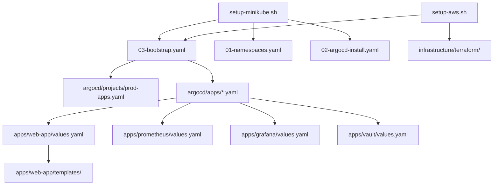

# Agent 1: Repository Mapper & Dependency Analyzer Report

**Date**: 2025-10-08  
**Status**: ✅ Complete

## 📊 Repository Structure Analysis

### ✅ CRITICAL FILES - DO NOT DELETE

#### ArgoCD Core (`argocd/`)
```
argocd/
├── install/
│   ├── 01-namespaces.yaml          # Creates argocd, monitoring, vault, production namespaces
│   ├── 02-argocd-install.yaml      # ArgoCD installation manifest
│   └── 03-bootstrap.yaml           # Creates argocd-projects app & root-app (App-of-Apps)
├── projects/
│   └── prod-apps.yaml              # AppProject for all production apps
└── apps/
    ├── web-app.yaml                # Web app ArgoCD Application
    ├── prometheus.yaml             # Prometheus ArgoCD Application
    ├── grafana.yaml                # Grafana ArgoCD Application
    └── vault.yaml                  # Vault ArgoCD Application
```

**Dependencies**: 
- `03-bootstrap.yaml` references `argocd/projects/` and `argocd/apps/`
- All apps in `argocd/apps/` reference `apps/*/values*.yaml` files
- `prod-apps.yaml` whitelists all Helm repo URLs

#### Helm Charts & Values (`apps/`)
```
apps/
├── web-app/                        # Custom Helm chart
│   ├── Chart.yaml                  # Chart metadata
│   ├── values.yaml                 # Default values
│   ├── values-minikube.yaml        # Minikube overrides
│   ├── values-aws.yaml             # AWS EKS overrides
│   └── templates/                  # K8s manifests
│       ├── _helpers.tpl
│       ├── deployment.yaml
│       ├── hpa.yaml
│       ├── ingress.yaml
│       ├── networkpolicy.yaml
│       ├── service.yaml
│       ├── serviceaccount.yaml
│       ├── servicemonitor.yaml
│       └── vault-agent.yaml
├── prometheus/
│   ├── values.yaml                 # Default Prometheus config
│   ├── values-minikube.yaml        # Minikube Prometheus config
│   └── values-aws.yaml             # AWS Prometheus config
├── grafana/
│   ├── values.yaml                 # Default Grafana config
│   ├── values-minikube.yaml        # Minikube Grafana config
│   └── values-aws.yaml             # AWS Grafana config
└── vault/
    ├── values.yaml                 # Default Vault config
    ├── values-minikube.yaml        # Minikube Vault config (dev mode)
    └── values-aws.yaml             # AWS Vault config (HA mode)
```

**Dependencies**:
- ArgoCD Applications reference these files via `helm.valueFiles`
- Web app chart templates use values from `values*.yaml`

#### Infrastructure (`infrastructure/`)
```
infrastructure/terraform/
├── main.tf                         # Main Terraform configuration
├── backend.tf                      # S3 backend for state
├── variables.tf                    # Input variables
├── outputs.tf                      # Output values
├── versions.tf                     # Provider versions
├── terraform.tfvars.example        # Example variables file
├── modules/
│   ├── eks/                        # EKS cluster module
│   ├── vpc/                        # VPC networking module
│   └── iam/                        # IAM roles and policies
```

**Dependencies**: 
- Referenced by `scripts/setup-aws.sh` (provisions EKS cluster)
- Not used by Minikube deployments

#### Scripts (`scripts/`)
```
scripts/
├── setup-minikube.sh               # ✅ KEEP - Standalone Minikube deployment
├── setup-aws.sh                    # ✅ KEEP - Standalone AWS deployment
├── deploy.sh                       # ⚠️ EVALUATE - General deployment script
├── secrets.sh                      # ⚠️ EVALUATE - Secrets management
├── config.sh                       # ⚠️ EVALUATE - Config management
├── validate.sh                     # ⚠️ EVALUATE - Main validation script
├── argo-diagnose.sh                # ⚠️ EVALUATE - ArgoCD diagnostics
├── redeploy.sh                     # ❌ DELETE - Redundant with deploy.sh
├── validate-argocd-apps.sh         # ❌ DELETE - Redundant validation
├── validate-deployment.sh          # ❌ DELETE - Redundant validation
├── validate-fixes.sh               # ❌ DELETE - Temporary validation
├── validate-gitops-fixes.sh        # ❌ DELETE - Temporary validation
└── validate-gitops-structure.sh    # ❌ DELETE - Temporary validation
```

**Dependencies**:
- `setup-minikube.sh` and `setup-aws.sh` are self-contained
- Other scripts may have cross-dependencies (needs analysis)

#### Documentation (`docs/`)
```
docs/
├── README.md                       # ✅ KEEP - Documentation index
├── architecture.md                 # ✅ KEEP - System architecture
├── local-deployment.md             # ✅ KEEP - Minikube deployment guide
├── aws-deployment.md               # ✅ KEEP - AWS deployment guide
├── DEPLOYMENT_GUIDE.md             # ⚠️ CONSOLIDATE - May overlap with other guides
├── troubleshooting.md              # ✅ KEEP - Troubleshooting guide
└── K8S_VERSION_POLICY.md           # ✅ KEEP - K8s version policy
```

---

## ❌ REDUNDANT FILES - SAFE TO DELETE

### 1. Bootstrap Directory (Redundant with `argocd/`)
```
bootstrap/
├── helm-values/
│   └── argo-cd-values.yaml         # ❌ Redundant - ArgoCD installed via manifest
└── README.md                       # ❌ Redundant - Covered in docs/
```

**Reason**: ArgoCD is now deployed via `argocd/install/02-argocd-install.yaml` manifest, not Helm chart.

### 2. Empty Environment Directories
```
environments/
├── aws/
│   └── README.md                   # ❌ Empty - Just a README
└── minikube/
    └── README.md                   # ❌ Empty - Just a README
```

**Reason**: No actual configuration files. Environment-specific configs are in `apps/*/values-*.yaml`.

### 3. Example Application (Unused)
```
examples/web-app/
├── Dockerfile                      # ❌ Not used by deployment
├── server.js                       # ❌ Not used by deployment
├── package.json                    # ❌ Not used by deployment
├── package-lock.json               # ❌ Not used by deployment
├── build-and-push.sh               # ❌ Not used by deployment
├── DOCKERHUB_SETUP.md              # ❌ Documentation only
├── IMAGE_BUILD_INSTRUCTIONS.md     # ❌ Documentation only
├── MULTI_ARCH_BUILD.md             # ❌ Documentation only
└── README.md                       # ❌ Documentation only
```

**Reason**: Example app source code. The deployed app uses image `windrunner101/k8s-web-app:v1.0.0` from Docker Hub.

### 4. Temporary Documentation Files
```
root/
├── CHANGELOG_REFACTOR.md           # ❌ Temporary refactor changelog
├── CLEANUP_PLAN.md                 # ❌ Planning document
├── REFACTOR_INVENTORY.md           # ❌ Temporary inventory
├── REFACTOR_SUMMARY.md             # ❌ Temporary summary
├── VALIDATION_REPORT.md            # ❌ Old validation report
├── VALIDATION-COMPLETE.md          # ❌ Old validation completion
└── README_NEW.md                   # ❌ Duplicate README
```

**Reason**: Temporary files from previous refactoring efforts.

### 5. Validation Reports Directory
```
validation-reports/
├── 00-VALIDATION-SUMMARY.md
├── 01-repo-integrity-report.md
├── 02-argocd-validation-report.md
├── 03-helm-lint-and-template-report.md
├── 04-cluster-validator-template.md
├── 05-environment-test-executor.md
├── 06-observability-vault-validator.md
├── README.md
└── remediation-patches/
    ├── 01-appproject-add-vault-repo.patch
    └── 02-cleanup-duplicates.sh
```

**Reason**: Old validation reports and patches. Already applied or obsolete.

### 6. Cleanup Scripts
```
root/
└── cleanup-duplicates.ps1          # ❌ PowerShell cleanup script
```

**Reason**: Temporary cleanup script, no longer needed.

### 7. Redundant Validation Scripts
```
scripts/
├── redeploy.sh                     # ❌ Redundant with deploy.sh
├── validate-argocd-apps.sh         # ❌ Redundant - Should be in validate.sh
├── validate-deployment.sh          # ❌ Redundant - Should be in validate.sh
├── validate-fixes.sh               # ❌ Temporary validation
├── validate-gitops-fixes.sh        # ❌ Temporary validation
└── validate-gitops-structure.sh    # ❌ Temporary validation
```

**Reason**: Multiple overlapping validation scripts. Should consolidate into single `validate.sh`.

---

## ⚠️ FILES TO EVALUATE

### Scripts Requiring Analysis
- `scripts/deploy.sh` - Check if used by README or other docs
- `scripts/secrets.sh` - Check if referenced in documentation
- `scripts/config.sh` - Check if used for config generation
- `scripts/validate.sh` - Main validation script (consolidate others into this)
- `scripts/argo-diagnose.sh` - Diagnostic utility (may be useful)

### Documentation to Consolidate
- `docs/DEPLOYMENT_GUIDE.md` - May overlap with `local-deployment.md` and `aws-deployment.md`

---

## 📈 Summary Statistics

| Category | Count | Status |
|----------|-------|--------|
| **Critical ArgoCD Files** | 9 | ✅ Keep |
| **Helm Charts & Values** | 13 | ✅ Keep |
| **Terraform Modules** | ~20 | ✅ Keep |
| **Essential Scripts** | 2 | ✅ Keep |
| **Essential Docs** | 6 | ✅ Keep |
| **Redundant Directories** | 3 | ❌ Delete |
| **Temporary Files** | 8 | ❌ Delete |
| **Redundant Scripts** | 6 | ❌ Delete |
| **Old Reports** | 9+ | ❌ Delete |

**Total Files to Delete**: ~30-35 files/directories  
**Total Files to Keep**: ~50 essential files  
**Reduction**: ~40-50% cleanup

---

## 🔗 Dependency Graph



---

## ✅ Agent 1 Recommendations

1. **Delete redundant directories**: `bootstrap/`, `environments/`, `examples/`, `validation-reports/`
2. **Delete temporary files**: All `CHANGELOG_REFACTOR`, `CLEANUP_PLAN`, `REFACTOR_*`, `VALIDATION*` files
3. **Consolidate scripts**: Merge validation scripts into single `validate.sh`
4. **Keep core infrastructure**: All `argocd/`, `apps/`, `infrastructure/`, essential scripts and docs
5. **Environment configs**: Already properly structured in `apps/*/values-*.yaml` files

**Next Step**: Proceed to Agent 2 for safe cleanup execution.

