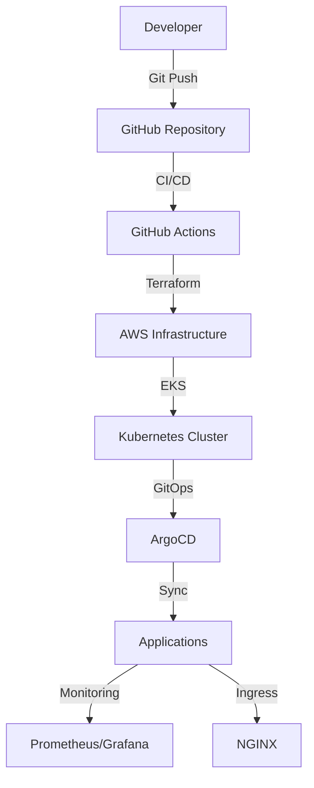

# Production-Ready EKS Cluster with GitOps

A step-by-step, beginner-friendly guide to deploying a production-grade Amazon EKS (Elastic Kubernetes Service) cluster using Infrastructure as Code (Terraform) and GitOps best practices (ArgoCD). This project covers the full lifecycle: infrastructure, GitOps, CI/CD, security, monitoring, documentation, and launch.

---

## 📊 Architecture Diagram



---

## 🚀 Project Lifecycle & Features

This repository implements a full, production-ready EKS platform with:
- **Infrastructure as Code**: Modular Terraform for VPC, EKS, IAM, and networking
- **GitOps**: ArgoCD for declarative, version-controlled Kubernetes deployments
- **CI/CD**: GitHub Actions for automated Terraform workflows
- **Security**: IAM, network policies, image scanning, secrets management
- **Monitoring**: Prometheus, Grafana, AlertManager, log aggregation
- **Documentation & Testing**: Comprehensive guides, onboarding, and automated tests
- **Launch & Maintenance**: Release, backup, disaster recovery, and ongoing improvements

---

## 🛠️ Prerequisites

- **AWS Account** (with admin or sufficient permissions)
- **AWS CLI** ([Install Guide](https://docs.aws.amazon.com/cli/latest/userguide/getting-started-install.html))
- **Terraform** ([Install Guide](https://developer.hashicorp.com/terraform/tutorials/aws-get-started/install-cli))
- **kubectl** ([Install Guide](https://kubernetes.io/docs/tasks/tools/))
- **git** ([Install Guide](https://git-scm.com/book/en/v2/Getting-Started-Installing-Git))

### AWS Account Setup
1. [Sign up for AWS](https://portal.aws.amazon.com/billing/signup)
2. [Create an IAM user](https://console.aws.amazon.com/iam/)
   - Attach `AdministratorAccess` policy (for demo; restrict in production)
3. [Configure AWS CLI credentials](https://docs.aws.amazon.com/cli/latest/userguide/cli-configure-quickstart.html):
   ```sh
   aws configure
   # Enter your AWS Access Key, Secret Key, region (e.g., us-east-1), and output format
   ```

---

## ⚡ Quickstart: Deploying the Infrastructure

1. **Clone the repository:**
   ```sh
   git clone https://github.com/your-org/Production-Ready-EKS-Cluster-with-GitOps.git
   cd Production-Ready-EKS-Cluster-with-GitOps
   ```
2. **Initialize Terraform:**
   ```sh
   cd terraform
   terraform init
   ```
3. **Review and customize variables:**
   - Edit `variables.tf` or create a `.tfvars` file for your environment.
4. **Plan the deployment:**
   ```sh
   terraform plan -var-file="your-env.tfvars"
   ```
5. **Apply the infrastructure:**
   ```sh
   terraform apply -var-file="your-env.tfvars"
   # Type 'yes' to confirm
   ```
6. **Configure kubectl for EKS:**
   ```sh
   aws eks --region <region> update-kubeconfig --name <cluster_name>
   ```
7. **Bootstrap ArgoCD (after EKS is ready):**
   - See `argo-cd/bootstrap/` (to be implemented)

---

## 📁 Module & Directory Structure

```
.
├── terraform/
│   ├── main.tf           # Root Terraform config
│   ├── variables.tf      # Root variables
│   ├── backend.tf        # Remote state backend
│   └── modules/
│       ├── vpc/          # VPC module (to be implemented)
│       └── eks/          # EKS module (to be implemented)
├── .github/
│   └── workflows/        # CI/CD workflows (to be implemented)
├── docs/                 # Documentation (to be implemented)
├── LICENSE               # MIT License
├── README.md             # This file
└── tasklist.md           # Implementation checklist
```

---

## 🧩 Project Phases (Lifecycle)

1. **Core Infrastructure**: VPC, EKS, IAM, networking
2. **GitOps**: ArgoCD setup, app-of-apps pattern, sample apps
3. **CI/CD**: GitHub Actions for Terraform, security scanning, drift detection
4. **Security & Monitoring**: Pod security, network policies, Prometheus, Grafana, alerting
5. **Documentation & Testing**: Guides, onboarding, automated tests
6. **Launch & Maintenance**: Release, backup, disaster recovery, ongoing improvements

See `tasklist.md` for a detailed, phase-by-phase breakdown.

---

## 🛠️ Troubleshooting & FAQ

- **Terraform errors**: Check AWS credentials, permissions, and region settings.
- **EKS not reachable**: Ensure VPC/subnet configuration and security groups allow access.
- **ArgoCD issues**: Confirm EKS is running and `kubectl` is configured.
- **Need help?**: Open an issue or check the [AWS EKS docs](https://docs.aws.amazon.com/eks/).

---

## 📄 License

This project is licensed under the MIT License. See [LICENSE](./LICENSE) for details.