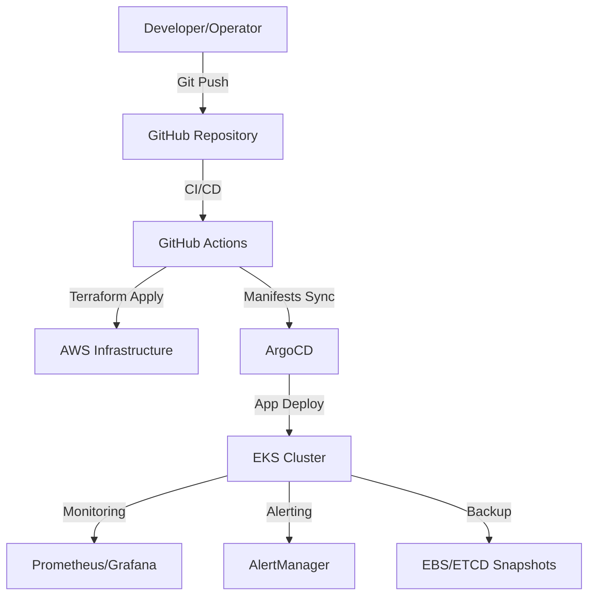

# Production-Ready EKS Cluster with GitOps

## Overview
This repository provides a fully automated, production-grade Amazon EKS (Elastic Kubernetes Service) cluster setup using GitOps principles with ArgoCD. It includes best practices for security, monitoring, CI/CD, disaster recovery, and ongoing maintenance. The platform is designed for scalability, maintainability, and rapid onboarding of new team members and applications.

---

## Features
- **Infrastructure as Code:** Modular Terraform for VPC, EKS, IAM, backup, and more.
- **GitOps with ArgoCD:** Declarative Kubernetes and application management.
- **CI/CD Pipelines:** Automated with GitHub Actions for Terraform, security, and cost checks.
- **Security:** OIDC for GitHub Actions, Pod Security Standards, IRSA, secret scanning, and more.
- **Monitoring & Alerting:** Prometheus, Grafana, AlertManager, FluentBit, and CloudWatch.
- **Disaster Recovery:** EBS/ETCD backup, runbooks, and regular recovery testing.
- **Comprehensive Documentation:** Onboarding, troubleshooting, guides, and runbooks.

---

## Prerequisites
- AWS account with required permissions (see `terraform/README.md` for minimal IAM policy)
- AWS CLI, kubectl, helm, terraform (>=1.4.0) installed
- GitHub repository with secrets configured for CI/CD
- (Optional) Infracost API key for cost estimation

---

## Quick Start
1. **Clone the repository**
   ```bash
   git clone https://github.com/YOUR_ORG/Production-Ready-EKS-Cluster-with-GitOps.git
   cd Production-Ready-EKS-Cluster-with-GitOps
   ```
2. **Configure AWS credentials**
   ```bash
   aws configure
   # Set region (e.g., eu-west-1)
   ```
3. **Set up GitHub Secrets**
   - Add AWS credentials and (optionally) Infracost API key to your repo secrets.
   - See `.github/workflows/terraform-deploy.yml` for required secret names.
4. **Provision Infrastructure with Terraform**
   ```bash
   cd terraform
   terraform init
   terraform plan -var-file="dev.tfvars"
   terraform apply -var-file="dev.tfvars"
   ```
5. **Deploy ArgoCD and Bootstrap Applications**
   - Apply manifests in `argo-cd/bootstrap/` (or use Helm with `values.yaml`)
   - Access ArgoCD UI and login with the admin credentials (see docs for details)
   - Sync the root app (`argo-cd/apps/root-app.yaml`) to deploy all workloads

---

## Directory Structure
- `terraform/` — Infrastructure as Code modules and root configuration
- `argo-cd/` — GitOps manifests, ArgoCD apps, values, and bootstrap configs
- `helm-charts/` — Custom Helm charts for applications
- `.github/workflows/` — CI/CD pipelines for Terraform, security, and more
- `docs/` — Comprehensive guides (onboarding, GitOps, monitoring, etc.)
- `tests/` — Infrastructure test suite scaffolding

## Git Workflow Commands

Below are the most common git commands used in this project, with explanations for when to use each:

- `git status` — Check which files have changed, which are staged, and which are untracked. Use this before staging or committing to review your working directory.
- `git add <file>` — Stage changes to specific files for the next commit. Use this after editing files you want to include in your next commit.
- `git commit -m "message"` — Commit staged changes with a descriptive message. Use this to save your work and document what you changed.
- `git push` — Upload your local commits to the remote repository (GitHub). Use this after committing to share your changes with the team or trigger CI/CD.
- `git branch` — List all branches or show the current branch. Use this to check your context or before creating a new branch.
- `git log main..[branch]` — View commits on your branch that are not on main. Use this to review your changes before merging or creating a PR.
- `git diff --name-status main` — See which files differ between your branch and main. Use this to quickly check what will be merged.
- `gh pr create --title "..." --body "..."` — Create a pull request on GitHub. Use this after pushing your branch to propose changes for review and merging.

These commands are typically used in the following order during a development cycle:
1. Edit files as needed
2. Run `git status` to see changes
3. Stage changes with `git add`
4. Commit with `git commit`
5. Push to remote with `git push`
6. (If working on a feature branch) Create a PR with `gh pr create`
7. Use `git log`, `git diff`, and `git branch` as needed to review and manage your work

---

## Key Documentation & Guides
- **[Running & Access Guide](docs/running-and-access.md):** How to run, configure, and access all components
- **[Onboarding Guide](docs/onboarding.md):** For new developers and operators
- **[ArgoCD Configuration](docs/argocd-configuration.md):** Setup, RBAC, app-of-apps
- **[Security Best Practices](docs/security-best-practices.md):** IAM, OIDC, secrets
- **[Monitoring & Alerting](docs/monitoring-alerting.md):** Prometheus, Grafana, AlertManager
- **[Monitoring Alerting Example](docs/monitoring-alerting-example.yaml):** Example Prometheus AlertManager config
- **[Application Deployment](docs/application-deployment.md):** Adding new apps
- **[GitOps Workflow](docs/gitops-workflow.md):** End-to-end GitOps process
- **[Environment Promotion](docs/environment-promotion.md):** Staging to production
- **[Performance Optimization](docs/performance-optimization.md):** Tuning and cost
- **[Acceptance Testing](docs/acceptance-testing.md):** Validation and UAT
- **[Launch Checklist](docs/launch-checklist.md):** Final review and go-live
- **[Support Process](docs/support-process.md):** Incident response and support
- **[Knowledge Transfer](docs/knowledge-transfer.md):** Handover and training
- **[Architecture Diagram](docs/architecture-diagram.md):** Visual overview of the platform

---

## CI/CD & Automation
- **Terraform Deploy:** Automated plan/apply, security scanning, cost estimation
- **Drift Detection:** Scheduled workflow to detect infrastructure drift
- **PR Comments:** Automated Terraform plan comments on pull requests
- **Secret & Dependency Scanning:** Trufflehog and dependency review
- **Image Scanning:** Trivy for container vulnerabilities

---

## Troubleshooting & FAQ
- See [TROUBLESHOOTING.md](./TROUBLESHOOTING.md) for common issues and solutions
- See [FAQ.md](./FAQ.md) for frequently asked questions

---

## Maintenance & Continuous Improvement
- Follow the tasklist for regular security updates, EKS upgrades, backup verification, and cost reviews
- Use GitHub Issues/Projects to track improvements and feedback

---

## How to Run This Repository
1. **Provision AWS infrastructure with Terraform** (see above)
2. **Deploy ArgoCD and bootstrap all applications** (see `argo-cd/bootstrap/` and `apps/`)
3. **Monitor CI/CD pipelines** for successful deployments and security checks
4. **Access ArgoCD UI** to manage and observe application state
5. **Review dashboards and alerts** in Grafana and AlertManager
6. **Follow runbooks and guides** for disaster recovery, onboarding, and support

---

## Architecture Diagram



---

For any questions or to contribute, please see the support and knowledge transfer guides in `/docs`.

**Recommended secrets scan:**
```bash
trufflehog filesystem .
# or
git-secrets --scan -r
```
