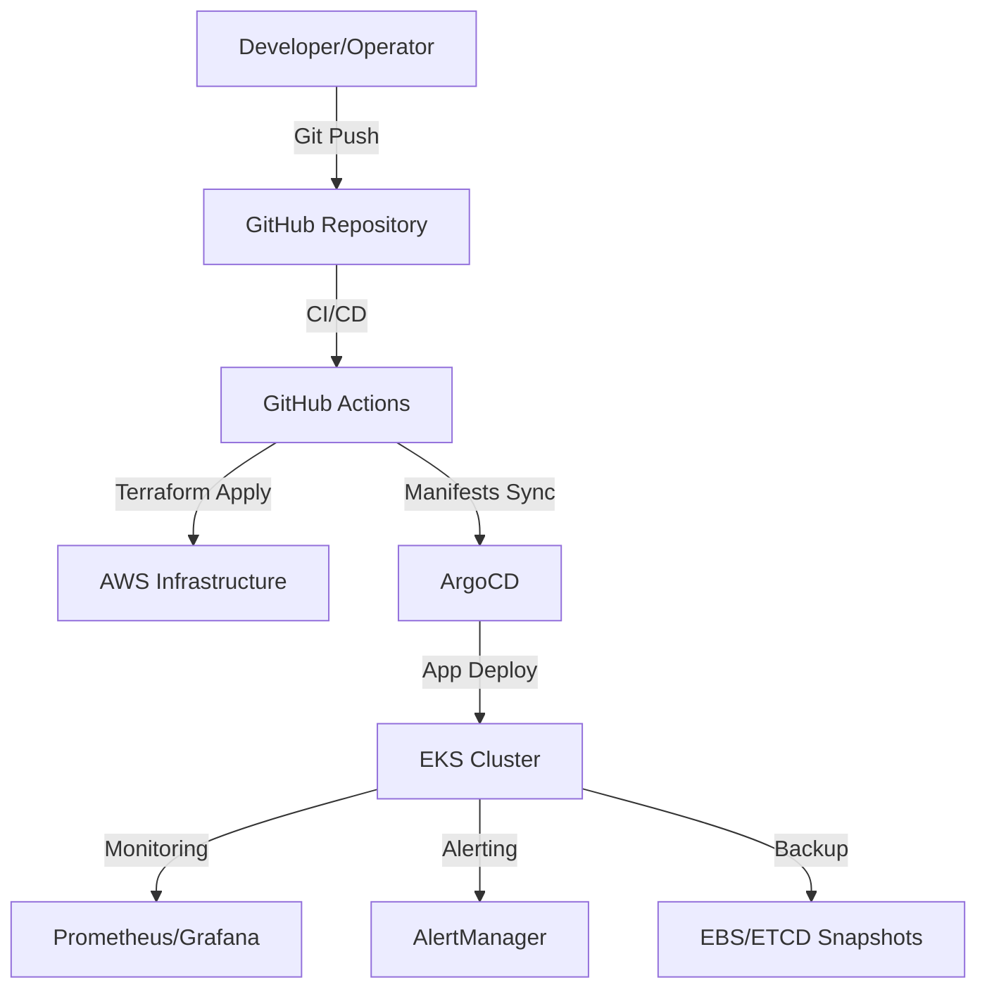

# Production-Ready EKS Cluster with GitOps

## Overview
This repository provides a fully automated, production-grade Amazon EKS (Elastic Kubernetes Service) cluster setup using GitOps principles with ArgoCD. It includes best practices for security, monitoring, CI/CD, disaster recovery, and ongoing maintenance. The platform is designed for scalability, maintainability, and rapid onboarding of new team members and applications.

---

## Features
- **Infrastructure as Code:** Modular Terraform for VPC, EKS, IAM, backup, and more.
- **GitOps with ArgoCD:** Declarative Kubernetes and application management using the app-of-apps pattern.
- **Security:** Pod Security Standards, IRSA, external-secrets with AWS Secrets Manager, and network policies.
- **Monitoring & Alerting:** Prometheus, Grafana, AlertManager, FluentBit, and CloudWatch.
- **Disaster Recovery:** EBS/ETCD backup resources, runbooks, and recovery testing guidance.
- **Comprehensive Documentation:** Onboarding, troubleshooting, guides, and runbooks under `docs/`.
- **Streamlined Deployment:** Simple Makefile targets and direct Terraform commands for easy deployment.

---

## Deployment Architecture

The deployment process uses a streamlined approach with Terraform and Makefile:

### Core Components
- **Terraform Modules** - Modular infrastructure as code for VPC, EKS, IAM, and backup
- **Makefile** - Convenient targets for common operations
- **ArgoCD** - GitOps workflow management with app-of-apps pattern

### Benefits of Simplified Design
- **Direct Control:** Direct Terraform and kubectl commands for transparency
- **Makefile Convenience:** Streamlined commands for common operations
- **Modular Infrastructure:** Well-organized Terraform modules
- **GitOps Integration:** ArgoCD for declarative application management
- **Easy Maintenance:** Clear separation between infrastructure and applications
- **Standard Tools:** Uses industry-standard tools without custom scripts

---

## Prerequisites

### Required Tools
- **AWS CLI** (v2.x) - [Installation Guide](https://docs.aws.amazon.com/cli/latest/userguide/getting-started-install.html)
- **kubectl** (v1.31+) - [Installation Guide](https://kubernetes.io/docs/tasks/tools/)
- **Helm** (v3.x) - [Installation Guide](https://helm.sh/docs/intro/install/)
- **Terraform** (>=1.4.0) - [Installation Guide](https://developer.hashicorp.com/terraform/downloads)
- **Git** - For repository management

### AWS Requirements
- AWS account with required permissions (see `terraform/README.md` for minimal IAM policy)
- AWS region configured (e.g., `eu-west-1`)
- IAM role for VPC flow logs (create before deployment)

### Optional Tools
- **GitHub Actions** or another CI/CD system
- **Infracost API key** for cost estimation
- **Docker** for local development and testing

### System Requirements
- **Minimum**: 4GB RAM, 2 CPU cores
- **Recommended**: 8GB RAM, 4 CPU cores
- **Storage**: 20GB free disk space
- **Network**: Stable internet connection for downloads

---

## Quick Start

### Prerequisites Setup
1. **Install Required Tools**
   ```bash
   # AWS CLI
   curl "https://awscli.amazonaws.com/awscli-exe-linux-x86_64.zip" -o "awscliv2.zip"
   unzip awscliv2.zip
   sudo ./aws/install
   
   # kubectl
   curl -LO "https://dl.k8s.io/release/$(curl -L -s https://dl.k8s.io/release/stable.txt)/bin/linux/amd64/kubectl"
   sudo install -o root -g root -m 0755 kubectl /usr/local/bin/kubectl
   
   # Helm
   curl https://raw.githubusercontent.com/helm/helm/main/scripts/get-helm-3 | bash
   
   # Terraform
   wget -O- https://apt.releases.hashicorp.com/gpg | gpg --dearmor | sudo tee /usr/share/keyrings/hashicorp-archive-keyring.gpg
   echo "deb [signed-by=/usr/share/keyrings/hashicorp-archive-keyring.gpg] https://apt.releases.hashicorp.com $(lsb_release -cs) main" | sudo tee /etc/apt/sources.list.d/hashicorp.list
   sudo apt update && sudo apt install terraform
   ```

2. **Clone the repository**
   ```bash
   git clone https://github.com/YOUR_ORG/Production-Ready-EKS-Cluster-with-GitOps.git
   cd Production-Ready-EKS-Cluster-with-GitOps
   ```

3. **Configure AWS credentials and region**
   ```bash
   aws configure
   # Enter your AWS Access Key ID, Secret Access Key, and region (e.g., eu-west-1)
   
   # Verify AWS access
   aws sts get-caller-identity
   ```

4. **Update configuration files**
   ```bash
   # Edit terraform/terraform.tfvars
   vim terraform/terraform.tfvars
   # Replace placeholder values:
   # - flow_log_iam_role_arn with your actual IAM role ARN
   # - tags with your organisation details
   
   # Update ArgoCD application manifests
   find argo-cd/apps -name "*.yaml" -exec sed -i 's/YOUR_ORG/your-github-org/g' {} \;
   ```

### Automated Deployment (Recommended)

5. **Use the Makefile for streamlined deployment**
   ```bash
   # Initialize Terraform backend
   make init
   
   # Review the infrastructure plan
   make plan
   
   # Deploy infrastructure (takes 15-20 minutes)
   make apply
   
   # Bootstrap ArgoCD and applications
   make argo-sync
   
   # Validate deployment
   make lint
   ```

   **Available Makefile Targets:**
   ```bash
   # Infrastructure Management
   make init      # Initialize Terraform backend
   make plan      # Show Terraform plan
   make apply     # Apply Terraform changes
   make destroy   # Destroy all infrastructure
   
   # Code Quality
   make lint      # Lint and validate Terraform code
   make fmt       # Auto-format Terraform code
   
   # ArgoCD Management
   make argo-sync # Bootstrap ArgoCD and root app
   ```

   **Deployment Features:**
   - **Streamlined Commands**: Simple make targets for common operations
   - **Terraform Integration**: Direct Terraform commands with proper configuration
   - **ArgoCD Bootstrap**: Automated ArgoCD installation and application deployment
   - **Code Quality**: Built-in linting and formatting capabilities
   - **Environment Variables**: Support for TF_VAR_* environment variables

### Manual Deployment (Alternative)

5. **Provision Infrastructure with Terraform**
   ```bash
   cd terraform
   
   # Initialize Terraform
   terraform init
   
   # Review the plan
   terraform plan -var-file="terraform.tfvars"
   
   # Apply the infrastructure (takes 15-20 minutes)
   terraform apply -var-file="terraform.tfvars"
   
   # Configure kubectl for the new cluster
   aws eks update-kubeconfig --region $(terraform output -raw aws_region) --name $(terraform output -raw cluster_name)
   
   # Verify cluster access
   kubectl get nodes
   ```

6. **Deploy ArgoCD and Bootstrap Applications**
   ```bash
   # Add ArgoCD Helm repository
   helm repo add argo https://argoproj.github.io/argo-helm
   helm repo update
   
   # Install ArgoCD using Helm (recommended for production)
   helm upgrade --install argocd argo/argo-cd \
     --namespace argocd \
     --create-namespace \
     --values argo-cd/bootstrap/values.yaml \
     --wait
   
   # Alternative: Use kubectl manifests (minimal setup)
   # kubectl apply -f argo-cd/bootstrap/argo-cd-install.yaml
   
   # Wait for ArgoCD to be ready
   kubectl wait --for=condition=available --timeout=300s deployment/argocd-server -n argocd
   ```

7. **Access ArgoCD and Bootstrap Applications**
   ```bash
   # Get ArgoCD admin password
   kubectl -n argocd get secret argocd-initial-admin-secret -o jsonpath="{.data.password}" | base64 -d && echo
   
   # Port-forward to access ArgoCD UI
   kubectl port-forward svc/argocd-server -n argocd 8080:443 &
   
   # Access ArgoCD UI at https://localhost:8080
   # Username: admin
   # Password: [from previous command]
   
   # Apply the root application to bootstrap all workloads
   kubectl apply -f argo-cd/apps/root-app.yaml
   
   # Monitor application deployment
   kubectl get applications -n argocd
   ```

### Post-Deployment Verification
8. **Verify all components are running**
   ```bash
   # Check all pods are running
   kubectl get pods -A
   
   # Check ArgoCD applications status
   kubectl get applications -n argocd
   
   # Access monitoring stack
   kubectl port-forward svc/grafana -n monitoring 3000:80 &
   kubectl port-forward svc/prometheus-server -n monitoring 9090:9090 &
   
   # Grafana: http://localhost:3000 (admin/password from secret)
   # Prometheus: http://localhost:9090
   ```

### Troubleshooting
9. **Common issues and solutions**
   ```bash
   # If ArgoCD applications are not syncing
   kubectl describe application <app-name> -n argocd
   
   # If pods are not starting
   kubectl describe pod <pod-name> -n <namespace>
   kubectl logs <pod-name> -n <namespace>
   
   # If Terraform fails
   terraform plan -var-file="terraform.tfvars"  # Review changes
   terraform destroy -var-file="terraform.tfvars"  # Clean up if needed
   ```

---

## Directory Structure
- `terraform/` — Infrastructure as Code modules and root configuration
- `argo-cd/` — GitOps manifests, ArgoCD apps, values, and bootstrap configs
- `helm-charts/` — Custom Helm charts for applications (if used)
- `docs/` — Comprehensive guides (onboarding, GitOps, monitoring, etc.)
- `tests/` — Infrastructure test suite scaffolding

## Git Workflow Commands

Below are the most common git commands used in this project, with explanations for when to use each:

- `git status` — Check which files have changed, which are staged, and which are untracked. Use this before staging or committing to review your working directory.
- `git add <file>` — Stage changes to specific files for the next commit. Use this after editing files you want to include in your next commit.
- `git commit -m "message"` — Commit staged changes with a descriptive message. Use this to save your work and document what you changed.
- `git push` — Upload your local commits to the remote repository (GitHub). Use this after committing to share your changes with the team or trigger CI/CD.
- `git branch` — List all branches or show the current branch. Use this to check your context or before creating a new branch.
- `git log main..[branch]` — View commits on your branch that are not on main. Use this to review your changes before merging or creating a PR.
- `git diff --name-status main` — See which files differ between your branch and main. Use this to quickly check what will be merged.
- `gh pr create --title "..." --body "..."` — Create a pull request on GitHub. Use this after pushing your branch to propose changes for review and merging.

These commands are typically used in the following order during a development cycle:
1. Edit files as needed
2. Run `git status` to see changes
3. Stage changes with `git add`
4. Commit with `git commit`
5. Push to remote with `git push`
6. (If working on a feature branch) Create a PR with `gh pr create`
7. Use `git log`, `git diff`, and `git branch` as needed to review and manage your work

---

## Key Documentation & Guides
- **[Running & Access Guide](docs/running-and-access.md):** How to run, configure, and access all components
- **[Onboarding Guide](docs/onboarding.md):** For new developers and operators
- **[ArgoCD Configuration](docs/argocd-configuration.md):** Setup, RBAC, app-of-apps
- **[Security Best Practices](docs/security-best-practices.md):** IAM, OIDC, secrets
- **[Monitoring & Alerting](docs/monitoring-alerting.md):** Prometheus, Grafana, AlertManager
- **[Monitoring Alerting Example](docs/monitoring-alerting-example.yaml):** Example Prometheus AlertManager config
- **[Application Deployment](docs/application-deployment.md):** Adding new apps
- **[GitOps Workflow](docs/gitops-workflow.md):** End-to-end GitOps process
- **[Environment Promotion](docs/environment-promotion.md):** Staging to production
- **[Performance Optimisation](docs/performance-optimization.md):** Tuning and cost
- **[Acceptance Testing](docs/acceptance-testing.md):** Validation and UAT
- **[Launch Checklist](docs/launch-checklist.md):** Final review and go-live
- **[Support Process](docs/support-process.md):** Incident response and support
- **[Knowledge Transfer](docs/knowledge-transfer.md):** Handover and training
- **[Architecture Diagram](docs/architecture-diagram.md):** Visual overview of the platform

---

## CI/CD & Automation
This repository is CI/CD-agnostic. You can integrate with GitHub Actions, GitLab CI, or another system:
- (Optional) Terraform plan/apply, security scanning, and cost estimation
- (Optional) Drift detection and PR comments
- (Optional) Secret & dependency scanning (e.g., Trufflehog, dependency review)
- (Optional) Image scanning (e.g., Trivy)

---

## Troubleshooting & FAQ
- See [TROUBLESHOOTING.md](./TROUBLESHOOTING.md) for common issues and solutions
- See [FAQ.md](./FAQ.md) for frequently asked questions

---

## Maintenance & Continuous Improvement
- Follow the tasklist for regular security updates, EKS upgrades, backup verification, and cost reviews
- Use GitHub Issues/Projects to track improvements and feedback

---

## Detailed Setup Guide

### Step-by-Step Deployment Process

#### 1. Pre-Deployment Checklist
- [ ] AWS account with appropriate permissions
- [ ] Required tools installed (AWS CLI, kubectl, Helm, Terraform)
- [ ] GitHub repository forked/cloned
- [ ] Configuration files updated with your values

#### 2. Infrastructure Provisioning
```bash
# Navigate to terraform directory
cd terraform

# Initialize Terraform backend
terraform init

# Review the infrastructure plan
terraform plan -var-file="terraform.tfvars"

# Deploy infrastructure (15-20 minutes)
terraform apply -var-file="terraform.tfvars"

# Save important outputs
terraform output > ../infrastructure-outputs.txt
```

#### 3. Cluster Access Configuration
```bash
# Configure kubectl for the new cluster
aws eks update-kubeconfig \
  --region $(terraform output -raw aws_region) \
  --name $(terraform output -raw cluster_name)

# Verify cluster access
kubectl get nodes
kubectl get namespaces
```

#### 4. ArgoCD Installation
```bash
# Add ArgoCD Helm repository
helm repo add argo https://argoproj.github.io/argo-helm
helm repo update

# Install ArgoCD with production configuration
helm upgrade --install argocd argo/argo-cd \
  --namespace argocd \
  --create-namespace \
  --values argo-cd/bootstrap/values.yaml \
  --wait

# Verify ArgoCD installation
kubectl get pods -n argocd
kubectl get svc -n argocd
```

#### 5. Application Bootstrap
```bash
# Get ArgoCD admin password
ARGOCD_PASSWORD=$(kubectl -n argocd get secret argocd-initial-admin-secret -o jsonpath="{.data.password}" | base64 -d)
echo "ArgoCD Admin Password: $ARGOCD_PASSWORD"

# Apply the root application (app-of-apps pattern)
kubectl apply -f argo-cd/apps/root-app.yaml

# Monitor application deployment
watch kubectl get applications -n argocd
```

#### 6. Access and Verification
```bash
# Port-forward ArgoCD UI
kubectl port-forward svc/argocd-server -n argocd 8080:443 &

# Access ArgoCD at https://localhost:8080
# Username: admin
# Password: [from step 5]

# Port-forward monitoring stack
kubectl port-forward svc/grafana -n monitoring 3000:80 &
kubectl port-forward svc/prometheus-server -n monitoring 9090:9090 &

# Access Grafana at http://localhost:3000
# Access Prometheus at http://localhost:9090
```

### Post-Deployment Operations

#### Daily Operations
- Monitor ArgoCD applications for sync status
- Check Grafana dashboards for cluster health
- Review AlertManager for any alerts
- Monitor resource usage and costs

#### Weekly Operations
- Review and update application configurations
- Check for security updates
- Verify backup processes
- Review access logs and audit trails

#### Monthly Operations
- Update Kubernetes and application versions
- Review and optimise resource allocation
- Conduct disaster recovery tests
- Review and update documentation

---

## Architecture Diagram



---

For any questions or to contribute, please see the support and knowledge transfer guides in `/docs`.

## Security Best Practices

### Pre-Deployment Security Checks
```bash
# Scan for secrets and sensitive data
trufflehog filesystem .
# or
git-secrets --scan -r

# Validate Terraform configuration
terraform validate
terraform plan -var-file="terraform.tfvars"

# Check Kubernetes manifests
kubeval argo-cd/apps/*.yaml
```

### Post-Deployment Security Verification
```bash
# Verify RBAC policies
kubectl get clusterroles
kubectl get clusterrolebindings

# Check network policies
kubectl get networkpolicies -A

# Verify pod security standards
kubectl get pods -A -o jsonpath='{range .items[*]}{.metadata.name}{"\t"}{.spec.securityContext}{"\n"}{end}'
```

## Cost Management

### Estimated Monthly Costs
- **EKS Cluster**: ~$73/month (control plane)
- **Worker Nodes**: ~$50-200/month (depending on instance types)
- **Load Balancers**: ~$20-50/month
- **Storage**: ~$10-30/month
- **Data Transfer**: ~$5-20/month

**Total Estimated Cost**: $150-400/month (varies by usage)

### Cost Optimisation Tips
- Use spot instances for non-critical workloads
- Implement cluster autoscaling
- Monitor resource usage with Prometheus/Grafana
- Regular cleanup of unused resources
- Use Infracost for cost estimation

## 🧹 Teardown

To destroy the infrastructure:

```bash
# Using Makefile (recommended)
make destroy

# Or manually with Terraform
cd terraform
terraform destroy -var-file="terraform.tfvars"
```

### Manual Kubernetes Cleanup

Before destroying infrastructure, clean up Kubernetes resources:

```bash
# Delete ArgoCD applications
kubectl delete applications --all -n argocd

# Delete monitoring stack
kubectl delete namespace monitoring

# Delete ArgoCD namespace
kubectl delete namespace argocd
```

### Teardown Features
- **Simple Commands**: Direct Terraform destroy or Makefile target
- **Manual Control**: Explicit Kubernetes cleanup for better control
- **State Management**: Proper Terraform state handling
- **Resource Verification**: Commands to verify complete cleanup
- **Flexible Approach**: Can be done step-by-step or all at once

## Support and Maintenance

### Getting Help
- Check [TROUBLESHOOTING.md](./TROUBLESHOOTING.md) for common issues
- Review [FAQ.md](./FAQ.md) for frequently asked questions
- Open an issue in the repository for bugs or feature requests
- Consult the documentation in the `docs/` directory

### Regular Maintenance Tasks
- **Weekly**: Review application logs and metrics
- **Monthly**: Update dependencies and security patches
- **Quarterly**: Review and optimise resource allocation
- **Annually**: Plan for major version upgrades

**Recommended secrets scan:**
```bash
trufflehog filesystem .
# or
git-secrets --scan -r
```
