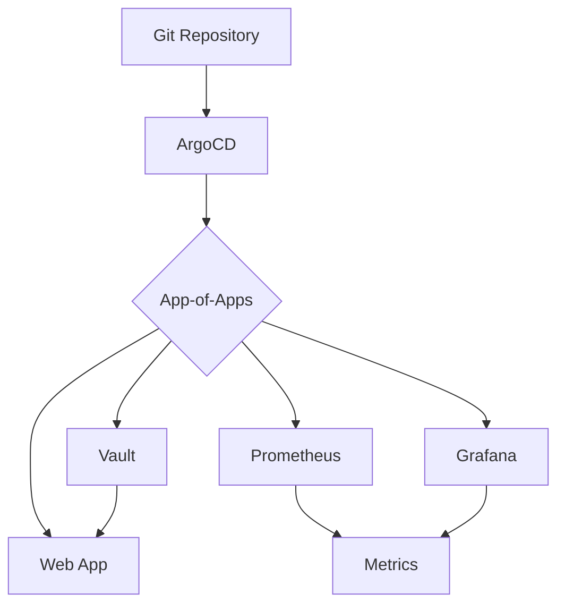

# Production-Ready GitOps Stack for Kubernetes

> **Minimal, production-grade Kubernetes deployment supporting both Minikube and AWS EKS**

[](https://kubernetes.io/)
[](https://argo-cd.readthedocs.io/)
[](https://www.terraform.io/)
[](LICENSE)

---

## 🚀 Quick Start

Choose your deployment target:

### Local Development (Minikube)
```bash
git clone https://github.com/humzamalak/Production-Ready-EKS-Cluster-with-GitOps.git
cd Production-Ready-EKS-Cluster-with-GitOps
./scripts/setup-minikube.sh
```

### Production (AWS EKS)
```bash
git clone https://github.com/humzamalak/Production-Ready-EKS-Cluster-with-GitOps.git
cd Production-Ready-EKS-Cluster-with-GitOps
./scripts/setup-aws.sh
```

---

## 📦 What's Included

### Core Stack
- 🔄 **ArgoCD** - GitOps continuous delivery with App-of-Apps pattern
- 📊 **Prometheus** - Metrics collection and monitoring (kube-prometheus-stack)
- 📈 **Grafana** - Visualization and dashboards with pre-installed templates
- 🔐 **Vault** - HashiCorp Vault for secrets management
- 🌐 **Web App** - Production-ready sample application

### Features
✅ **Single Repository** - All manifests in one place  
✅ **Environment-Specific Values** - Different configs for Minikube/AWS  
✅ **Security Best Practices** - Pod Security Standards, NetworkPolicies, seccomp  
✅ **High Availability** - HA configurations for production  
✅ **GitOps Workflow** - Automated sync and self-healing  
✅ **Kubernetes 1.33+ Compatible** - Latest stable APIs  

---

## 📁 Repository Structure

```
/
├── argocd/                    # ArgoCD installation and applications
│   ├── install/              # Bootstrap manifests (01-03)
│   ├── projects/             # AppProject (prod-apps)
│   └── apps/                 # Application manifests (4 apps)
│
├── apps/                      # Helm charts and values
│   ├── web-app/              # Web application chart
│   │   ├── Chart.yaml
│   │   ├── values.yaml       # Default values
│   │   ├── values-minikube.yaml
│   │   ├── values-aws.yaml
│   │   └── templates/
│   ├── prometheus/           # Prometheus values (chart from Helm repo)
│   ├── grafana/              # Grafana values (chart from Helm repo)
│   └── vault/                # Vault values (chart from Helm repo)
│
├── environments/              # Environment-specific configs
│   ├── minikube/             # Local development
│   └── aws/                  # Production AWS EKS
│
├── infrastructure/            # Terraform for AWS
│   └── terraform/
│       ├── modules/          # EKS, VPC, IAM modules
│       └── *.tf              # Main Terraform files
│
├── scripts/                   # Deployment scripts
│   ├── setup-minikube.sh     # Full Minikube setup
│   ├── setup-aws.sh          # Full AWS EKS setup
│   ├── deploy.sh             # Existing deployment script
│   └── *.sh                  # Other utility scripts
│
├── docs/                      # Documentation
│   └── DEPLOYMENT_GUIDE.md   # Complete deployment guide
│
├── examples/                  # Example applications
│   └── web-app/              # Sample Node.js app
│
└── README.md                  # This file
```

---

## 🎯 Architecture

### GitOps Flow



### Deployment Strategy

1. **Bootstrap**: Deploy ArgoCD and AppProject
2. **Root App**: Deploy App-of-Apps pattern
3. **Applications**: ArgoCD syncs 4 child apps:
   - Vault (sync wave 2)
   - Prometheus (sync wave 3)
   - Grafana (sync wave 4)
   - Web App (sync wave 5)

---

## 📖 Documentation

| Document | Description |
|----------|-------------|
| [**DEPLOYMENT_GUIDE.md**](docs/DEPLOYMENT_GUIDE.md) | Complete deployment guide for Minikube and AWS |
| [REFACTOR_INVENTORY.md](REFACTOR_INVENTORY.md) | Before/after analysis and migration notes |
| [VALIDATION_REPORT.md](VALIDATION_REPORT.md) | Validation results for all manifests |
| [CLEANUP_PLAN.md](CLEANUP_PLAN.md) | Files to remove during cleanup |

---

## 🖥️ Supported Environments

### Minikube (Local Development)

**Resources Required:**
- CPU: 4 cores
- RAM: 8GB
- Disk: 20GB

**Features:**
- Dev mode Vault
- Single replica deployments
- Minimal resource limits
- Local ingress
- Fast iteration

### AWS EKS (Production)

**Resources:**
- EKS Control Plane
- Worker nodes (t3.medium x3)
- EBS volumes (gp3)
- Application Load Balancers

**Features:**
- High availability (multiple replicas)
- Pod anti-affinity rules
- Production storage
- ALB Ingress
- Auto-scaling (HPA)

---

## 🔧 Prerequisites

### Common
- `kubectl` 1.33+
- `helm` 3.x
- `git`

### Minikube
- `minikube` 1.30+
- `docker` 20.x+

### AWS EKS
- `aws` CLI 2.x
- `terraform` 1.5+
- AWS account with appropriate IAM permissions

---

## 🚦 Deployment Steps

### Minikube

1. **Start Minikube**
   ```bash
   minikube start --cpus=4 --memory=8192 --disk-size=20g
   ```

2. **Run Setup Script**
   ```bash
   ./scripts/setup-minikube.sh
   ```

3. **Access Applications**
   ```bash
   # ArgoCD
   kubectl port-forward -n argocd svc/argocd-server 8080:443
   
   # Grafana
   kubectl port-forward -n monitoring svc/grafana 3000:80
   ```

### AWS EKS

1. **Configure AWS**
   ```bash
   aws configure
   export AWS_REGION=us-east-1
   ```

2. **Provision Infrastructure**
   ```bash
   cd infrastructure/terraform
   terraform init
   terraform apply
   ```

3. **Run Setup Script**
   ```bash
   cd ../..
   ./scripts/setup-aws.sh
   ```

4. **Configure DNS and Certificates**
   - Create Route53 records
   - Create ACM certificates
   - Update Ingress annotations

---

## 🔐 Security Features

### Pod Security
- ✅ **Pod Security Standards** enforced at namespace level
- ✅ **Security Contexts** with non-root users (UID 1001)
- ✅ **seccomp Profiles** (RuntimeDefault)
- ✅ **Read-only Root Filesystem** where applicable
- ✅ **Dropped ALL Capabilities** (least privilege)

### Network Security
- ✅ **NetworkPolicies** with default-deny
- ✅ **Namespace Isolation** via label selectors
- ✅ **Ingress Rules** restricting external access
- ✅ **Egress Controls** for sensitive workloads

### Secrets Management
- ✅ **Vault Integration** for dynamic secrets
- ✅ **Vault Agent Injector** for automatic injection
- ✅ **Kubernetes Auth** method
- ✅ **Policy-based Access Control**

---

## 📊 Monitoring & Observability

### Prometheus
- Node metrics via node-exporter
- Kubernetes metrics via kube-state-metrics
- Application metrics via ServiceMonitors
- Custom PrometheusRules for alerting
- 15-day retention (production)

### Grafana
- Pre-installed dashboards:
  - Kubernetes Cluster Monitoring (7249)
  - Kubernetes Pods Monitoring (6417)
  - Node Exporter Full (1860)
- Prometheus datasource auto-configured
- Persistent storage for custom dashboards

### Alertmanager
- Alert routing and grouping
- Integration with notification channels
- Alert silencing and inhibition

---

## 🛠️ Management

### Updating Applications

```bash
# Update values in Git
vim apps/web-app/values.yaml
git add apps/web-app/values.yaml
git commit -m "Update web-app configuration"
git push

# ArgoCD auto-syncs (or manual sync)
kubectl get applications -n argocd
```

### Scaling

```bash
# View HPA status
kubectl get hpa -n production

# Manual scaling (testing)
kubectl scale deployment web-app -n production --replicas=5
```

### Secrets Management

```bash
# Create Grafana admin secret
kubectl create secret generic grafana-admin-secret \
  --from-literal=admin-user=admin \
  --from-literal=admin-password='SecurePassword123!' \
  -n monitoring
```

---

## 🔍 Troubleshooting

### ArgoCD App Not Syncing
```bash
# Check app status
kubectl describe application web-app -n argocd

# Manual sync
kubectl patch application web-app -n argocd \
  --type merge -p '{"operation":{"initiatedBy":{"username":"admin"},"sync":{"revision":"HEAD"}}}'
```

### Pods Not Starting
```bash
# Describe pod
kubectl describe pod <pod-name> -n <namespace>

# Check logs
kubectl logs <pod-name> -n <namespace>

# Check events
kubectl get events -n <namespace> --sort-by='.lastTimestamp'
```

### Prometheus Not Scraping
```bash
# List ServiceMonitors
kubectl get servicemonitor -A

# Check Prometheus targets
kubectl port-forward -n monitoring svc/prometheus-kube-prometheus-prometheus 9090:9090
# Visit http://localhost:9090/targets
```

---

## 📈 Cost Estimation (AWS)

| Component | Monthly Cost (Est.) |
|-----------|---------------------|
| EKS Control Plane | $73 |
| Worker Nodes (t3.medium x3) | $90 |
| EBS Volumes (gp3) | $30 |
| Load Balancers | $50 |
| Data Transfer | $20 |
| **Total** | **~$265/month** |

*Costs vary by region and actual usage*

---

## 🤝 Contributing

1. Fork the repository
2. Create a feature branch
3. Make your changes
4. Test on Minikube
5. Submit a pull request

---

## 📄 License

This project is licensed under the MIT License - see the [LICENSE](LICENSE) file for details.

---

## 🆘 Support

- 📖 [Full Deployment Guide](docs/DEPLOYMENT_GUIDE.md)
- 🐛 [GitHub Issues](https://github.com/humzamalak/Production-Ready-EKS-Cluster-with-GitOps/issues)
- 📧 Contact: devops@example.com

---

## 🙏 Acknowledgments

- [ArgoCD Project](https://argoproj.github.io/argo-cd/)
- [Prometheus Community](https://prometheus.io/)
- [Grafana Labs](https://grafana.com/)
- [HashiCorp Vault](https://www.vaultproject.io/)
- [Kubernetes Community](https://kubernetes.io/)

---

**Last Updated:** 2025-10-08  
**Version:** 1.0.0 (Refactored)  
**Kubernetes Compatibility:** 1.33+


