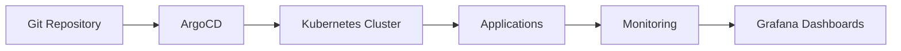

# 📖 Complete Deployment Guide

> **Production-Ready GitOps Stack for Kubernetes**  
> Supports both local Minikube development and AWS EKS production deployments

---

## 📋 Table of Contents

1. [Overview](#overview)
2. [Architecture](#architecture)
3. [Prerequisites](#prerequisites)
4. [Minikube Deployment](#minikube-deployment)
5. [AWS EKS Deployment](#aws-eks-deployment)
6. [Post-Deployment Configuration](#post-deployment-configuration)
7. [Application Access](#application-access)
8. [Troubleshooting](#troubleshooting)
9. [Maintenance](#maintenance)

---

## 🎯 Overview

This GitOps repository provides a complete, production-ready Kubernetes stack with:

- **ArgoCD** - GitOps continuous delivery
- **Prometheus** - Metrics collection and monitoring
- **Grafana** - Visualization and dashboards
- **HashiCorp Vault** - Secrets management
- **Web App** - Sample production workload

### Key Features

✅ **Unified Manifests** - Same YAML for Minikube and AWS  
✅ **Environment-Specific Values** - Different resources per environment  
✅ **Security Best Practices** - Pod Security Standards, NetworkPolicies  
✅ **High Availability** - HA configurations for production  
✅ **GitOps Workflow** - Automated sync and self-healing  
✅ **Kubernetes 1.33+ Compatible** - Latest API versions  
✅ **ArgoCD 3.1.0** - Latest features and security enhancements  

---

## 🏗️ Architecture

### Repository Structure

```
/
├── argo-apps/                 # ArgoCD GitOps Configuration
│   ├── install/              # ArgoCD installation manifests
│   │   ├── 01-namespaces.yaml
│   │   ├── 02-argocd-install.yaml
│   │   └── 03-bootstrap.yaml
│   ├── projects/             # ArgoCD Projects (RBAC, repos)
│   │   └── prod-apps.yaml
│   └── apps/                 # ArgoCD Applications (app manifests)
│       ├── web-app.yaml
│       ├── prometheus.yaml
│       ├── grafana.yaml
│       └── vault.yaml
│
├── helm-charts/               # Helm Charts & Values
│   ├── web-app/              # Custom web app Helm chart
│   ├── prometheus/           # Prometheus values (uses upstream chart)
│   ├── grafana/              # Grafana values (uses upstream chart)
│   └── vault/                # Vault values (uses upstream chart)
│
├── terraform/                 # Infrastructure as Code (Multi-Cloud Ready)
│   ├── environments/
│   │   └── aws/              # AWS-specific Terraform
│   └── modules/              # Reusable Terraform modules
│       ├── vpc/
│       ├── eks/
│       └── iam/
│
├── .github/workflows/         # CI/CD Automation
│   ├── validate.yaml
│   ├── docs-lint.yaml
│   ├── terraform-plan.yaml
│   ├── terraform-apply.yaml
│   ├── deploy-argocd.yaml
│   └── security-scan.yaml
│
├── scripts/                   # Deployment & Management Scripts
│   ├── deploy.sh             # Unified deployment interface
│   ├── setup-minikube.sh     # Minikube setup
│   ├── setup-aws.sh          # AWS EKS setup
│   ├── argocd-login.sh       # ArgoCD CLI authentication
│   └── validate.sh           # Validation script
│
└── docs/                      # Documentation
    ├── architecture.md
    ├── deployment.md
    ├── ci_cd_pipeline.md
    ├── scripts.md
    └── troubleshooting.md
```

**Key Differences from Standard GitOps Repos:**
- ✅ Multi-cloud ready Terraform structure (`environments/aws`, future GCP/Azure)
- ✅ Clear separation: `argo-apps` for GitOps, `helm-charts` for Helm
- ✅ Upstream Helm charts with values-only overrides (no chart duplication)
- ✅ Comprehensive CI/CD with GitHub Actions
- ✅ Enterprise-grade tooling (Makefile with help, validation scripts)

### GitOps Flow



1. Changes pushed to Git repository
2. ArgoCD detects changes
3. ArgoCD syncs to Kubernetes
4. Applications deployed/updated
5. Prometheus scrapes metrics
6. Grafana displays dashboards

---

## ✅ Prerequisites

### For Minikube (Local Development)

| Tool | Version | Purpose |
|------|---------|---------|
| **Minikube** | 1.30+ | Local Kubernetes cluster |
| **kubectl** | 1.33+ | Kubernetes CLI |
| **Helm** | 3.x | Package manager |
| **Docker** | 20.x+ | Container runtime |

**System Requirements:**
- CPU: 4 cores minimum
- RAM: 8GB minimum
- Disk: 20GB free space

### For AWS EKS (Production)

| Tool | Version | Purpose |
|------|---------|---------|
| **AWS CLI** | 2.x | AWS command line |
| **Terraform** | 1.5+ | Infrastructure as code |
| **kubectl** | 1.33+ | Kubernetes CLI |
| **Helm** | 3.x | Package manager |

**AWS Requirements:**
- AWS Account with admin or appropriate IAM permissions
- VPC with public/private subnets
- Route53 hosted zone (for DNS)
- ACM certificates (for HTTPS)

---

## 🖥️ Minikube Deployment

### Step 1: Clone Repository

```bash
git clone https://github.com/humzamalak/Production-Ready-EKS-Cluster-with-GitOps.git
cd Production-Ready-EKS-Cluster-with-GitOps
```

### Step 2: Start Minikube

```bash
# Start with recommended resources
minikube start --cpus=4 --memory=8192 --disk-size=20g

# Enable required addons
minikube addons enable ingress
minikube addons enable metrics-server
```

### Step 3: Run Setup Script

```bash
./scripts/setup-minikube.sh
```

Or using Makefile:
```bash
make deploy-minikube
```

The script automatically:
1. ✅ Checks prerequisites (kubectl, helm, minikube)
2. ✅ Starts/verifies Minikube
3. ✅ Enables required addons
4. ✅ Deploys ArgoCD
5. ✅ Bootstraps applications via GitOps
6. ✅ Provides access credentials

### Step 4: Verify Deployment

```bash
# Check all pods are running
kubectl get pods -A

# Check ArgoCD applications
kubectl get applications -n argocd

# Check ArgoCD sync status
kubectl get applications -n argocd -o jsonpath='{range .items[*]}{.metadata.name}{"\t"}{.status.health.status}{"\t"}{.status.sync.status}{"\n"}{end}'
```

### Step 5: Access Applications

#### ArgoCD UI

```bash
kubectl port-forward -n argocd svc/argocd-server 8080:443
```

Open: `http://localhost:8080`  
Username: `admin`  
Password: (shown by setup script)

#### Grafana

```bash
kubectl port-forward -n monitoring svc/grafana 3000:80
```

Open: `http://localhost:3000`  
Username: `admin`  
Password: `admin`

#### Prometheus

```bash
kubectl port-forward -n monitoring svc/prometheus-kube-prometheus-prometheus 9090:9090
```

Open: `http://localhost:9090`

#### Vault

```bash
kubectl port-forward -n vault svc/vault 8200:8200
```

Open: `http://localhost:8200`  
Token: `root` (dev mode)

#### Web App

```bash
minikube service -n production web-app
```

---

## ☁️ AWS EKS Deployment

### Step 1: Clone Repository

```bash
git clone https://github.com/humzamalak/Production-Ready-EKS-Cluster-with-GitOps.git
cd Production-Ready-EKS-Cluster-with-GitOps
```

### Step 2: Configure AWS

```bash
# Configure AWS credentials
aws configure

# Set environment variables
export AWS_REGION=us-east-1
export CLUSTER_NAME=production-cluster
```

### Step 3: Provision Infrastructure

```bash
cd terraform/environments/aws

# Initialize Terraform
terraform init

# Review plan
terraform plan

# Apply infrastructure (15-20 minutes)
terraform apply
```

Or using Makefile from repository root:
```bash
make init   # Initialize Terraform
make plan   # Review plan
make apply  # Deploy infrastructure
```

This creates:
- VPC with public/private subnets across multiple AZs
- EKS cluster (Kubernetes v1.33)
- Managed node groups with autoscaling
- IAM roles and policies (including IRSA)
- Security groups and network policies
- CloudWatch logging
- Cost monitoring tags

### Step 4: Configure kubectl

```bash
aws eks update-kubeconfig --name $CLUSTER_NAME --region $AWS_REGION
```

### Step 5: Run Setup Script

```bash
cd ../../..  # Return to repository root
./scripts/setup-aws.sh
```

Or using Makefile:
```bash
make deploy-aws
```

### Step 6: Install AWS Load Balancer Controller

```bash
# Add helm repo
helm repo add eks https://aws.github.io/eks-charts
helm repo update

# Install controller
helm install aws-load-balancer-controller eks/aws-load-balancer-controller \
  -n kube-system \
  --set clusterName=$CLUSTER_NAME \
  --set serviceAccount.create=true \
  --set serviceAccount.name=aws-load-balancer-controller
```

### Step 7: Configure DNS and Certificates

1. **Create Route53 A records** pointing to ALB
2. **Create ACM certificates** for your domains
3. **Update Ingress annotations** with certificate ARNs

Example:
```yaml
annotations:
  alb.ingress.kubernetes.io/certificate-arn: arn:aws:acm:us-east-1:123456789012:certificate/xxx
```

### Step 8: Update Application Values for AWS

Update ArgoCD applications to use AWS-specific values:

```bash
# Uncomment values-aws.yaml in all application manifests
sed -i 's|# *- values-aws.yaml|- values-aws.yaml|g' argo-apps/apps/*.yaml

# Commit changes
git add argo-apps/apps/
git commit -m "Enable AWS values for production deployment"
git push
```

Example configuration in `argo-apps/apps/web-app.yaml`:
```yaml
helm:
  valueFiles:
    - values.yaml
    - values-aws.yaml  # Uncommented for AWS
```

ArgoCD will automatically sync the updated configuration.

### Step 9: Create Secrets

```bash
# Grafana admin secret
kubectl create secret generic grafana-admin-secret \
  --from-literal=admin-user=admin \
  --from-literal=admin-password='YourSecurePassword123!' \
  -n monitoring

# Additional secrets as needed
```

---

## ⚙️ Post-Deployment Configuration

### Initialize Vault (Production Only)

```bash
# Port-forward to Vault
kubectl port-forward -n vault svc/vault 8200:8200

# Initialize Vault
export VAULT_ADDR='http://127.0.0.1:8200'
vault operator init

# Save the unseal keys and root token securely!

# Unseal Vault (run 3 times with different keys)
vault operator unseal <key1>
vault operator unseal <key2>
vault operator unseal <key3>

# Login
vault login <root-token>

# Enable Kubernetes auth
vault auth enable kubernetes

# Configure Kubernetes auth
vault write auth/kubernetes/config \
    kubernetes_host="https://kubernetes.default.svc.cluster.local:443"
```

### Configure Prometheus Alerting

1. Create Alertmanager configuration
2. Create PrometheusRule for alerts
3. Configure notification channels (Slack, email, etc.)

### Import Grafana Dashboards

1. Login to Grafana
2. Navigate to Dashboards → Import
3. Import popular dashboards:
   - **7249** - Kubernetes Cluster Monitoring
   - **6417** - Kubernetes Pods Monitoring
   - **1860** - Node Exporter Full

---

## 🔐 Application Access

### Minikube

| App | Access Method | URL |
|-----|---------------|-----|
| ArgoCD | Port-forward | `http://localhost:8080` |
| Grafana | Port-forward | `http://localhost:3000` |
| Prometheus | Port-forward | `http://localhost:9090` |
| Vault | Port-forward | `http://localhost:8200` |
| Web App | Minikube service | `minikube service` |

### AWS EKS

| App | Access Method | URL |
|-----|---------------|-----|
| ArgoCD | ALB Ingress | `https://argocd.example.com` |
| Grafana | ALB Ingress | `https://grafana.example.com` |
| Prometheus | ALB Ingress | `https://prometheus.example.com` |
| Vault | ALB Ingress | `https://vault.example.com` |
| Web App | ALB Ingress | `https://web-app.example.com` |

---

## 🔧 Troubleshooting

### ArgoCD Application Not Syncing

```bash
# Check application status
kubectl describe application <app-name> -n argocd

# View sync status
argocd app get <app-name>

# Manual sync
argocd app sync <app-name>
```

### Pods Not Starting

```bash
# Check pod status
kubectl describe pod <pod-name> -n <namespace>

# View logs
kubectl logs <pod-name> -n <namespace>

# Check events
kubectl get events -n <namespace> --sort-by='.lastTimestamp'
```

### Prometheus Not Scraping Metrics

```bash
# Check ServiceMonitor
kubectl get servicemonitor -A

# Check Prometheus targets
kubectl port-forward -n monitoring svc/prometheus-kube-prometheus-prometheus 9090:9090
# Open http://localhost:9090/targets
```

### Vault Not Injecting Secrets

```bash
# Check Vault injector logs
kubectl logs -n vault -l app.kubernetes.io/name=vault-agent-injector

# Check pod annotations
kubectl describe pod <pod-name> -n <namespace>

# Verify Vault auth
vault read auth/kubernetes/role/<role-name>
```

---

## 🛠️ Maintenance

### Updating Applications

```bash
# Update Helm values in Git repository
git add helm-charts/<app-name>/values-aws.yaml
git commit -m "Update <app-name> configuration"
git push

# ArgoCD will auto-sync automatically
# Or force sync:
kubectl patch application <app-name> -n argocd --type merge -p '{"operation":{"sync":{}}}'

# Using ArgoCD CLI:
argocd app sync <app-name>
```

**Using Makefile:**
```bash
make argo-sync  # Sync all applications
```

### Scaling Applications

```bash
# Scale via HPA (automatic)
kubectl get hpa -n <namespace>

# Manual scaling (for testing)
kubectl scale deployment <deployment-name> -n <namespace> --replicas=5
```

### Backup and Restore

#### Backup Prometheus Data

```bash
# Use Velero or manual PV snapshots
# Prometheus data is in PersistentVolume
```

#### Backup ArgoCD Configuration

```bash
# Export applications
kubectl get applications -n argocd -o yaml > argocd-apps-backup.yaml

# Export projects
kubectl get appprojects -n argocd -o yaml > argocd-projects-backup.yaml
```

#### Backup Vault Data

```bash
# Vault operator manual backup
vault operator raft snapshot save backup.snap
```

---

## 📚 Additional Resources

- **ArgoCD Documentation**: https://argo-cd.readthedocs.io/
- **Prometheus Documentation**: https://prometheus.io/docs/
- **Grafana Documentation**: https://grafana.com/docs/
- **Vault Documentation**: https://www.vaultproject.io/docs/
- **Kubernetes Documentation**: https://kubernetes.io/docs/

---

## 🆘 Getting Help

1. Check the [Troubleshooting](#troubleshooting) section
2. Review application logs: `kubectl logs -n <namespace> <pod-name>`
3. Check ArgoCD UI for sync errors
4. Review Prometheus alerts in Grafana
5. Open an issue on GitHub

---

**Last Updated:** 2025-10-08  
**Version:** 1.0.0  
**Kubernetes Compatibility:** 1.33+


