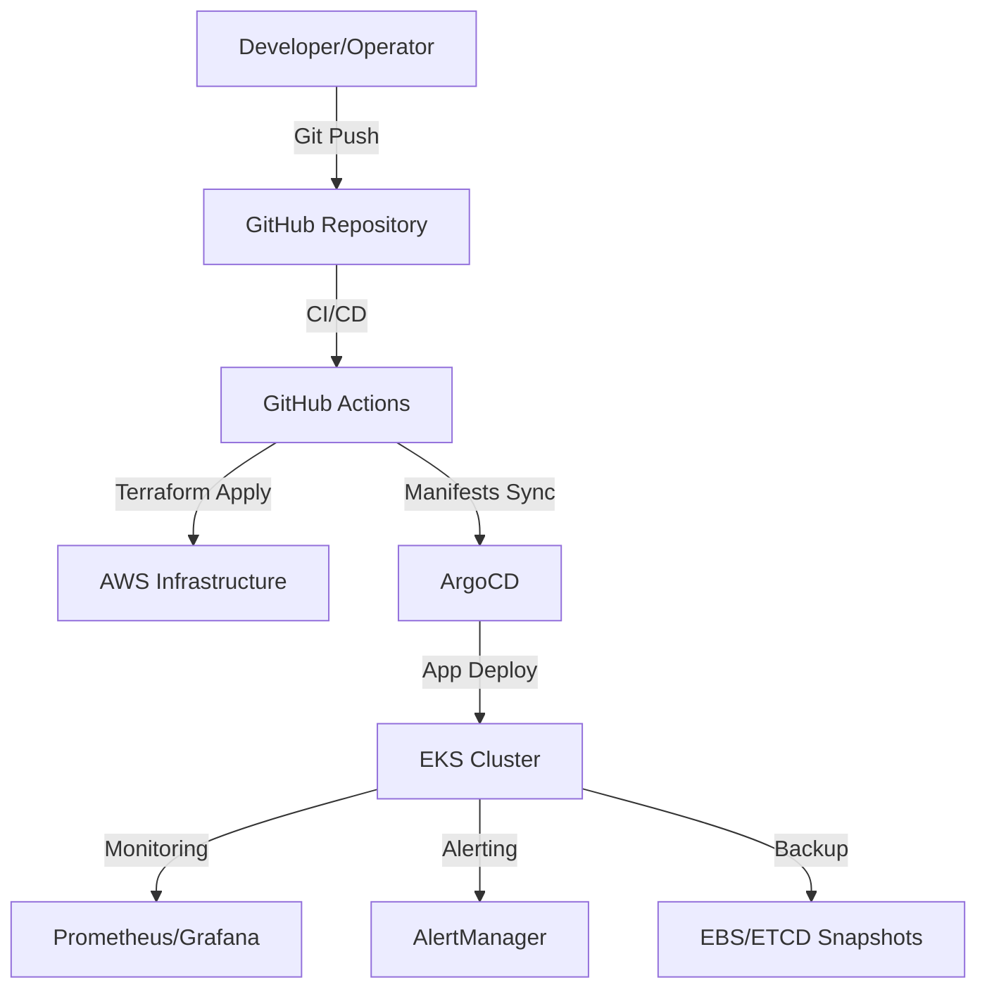

# Architecture Diagram

Below is a high-level architecture diagram for the Production-Ready EKS Cluster with GitOps setup. This diagram illustrates the flow from code commit to deployment, monitoring, and backup.

## Components
- **Developer/Operator:** Initiates changes via Git
- **GitHub Repository:** Stores code, manifests, and Terraform
- **GitHub Actions:** Automates CI/CD, Terraform, and security checks
- **AWS Infrastructure:** VPC, EKS, IAM, and supporting resources
- **ArgoCD:** GitOps controller for Kubernetes
- **EKS Cluster:** Runs workloads and applications
- **Prometheus/Grafana:** Monitoring and observability
- **AlertManager:** Alerting and notifications
- **EBS/ETCD Snapshots:** Backup and disaster recovery

---

For more details, see the main [README.md](../README.md).
