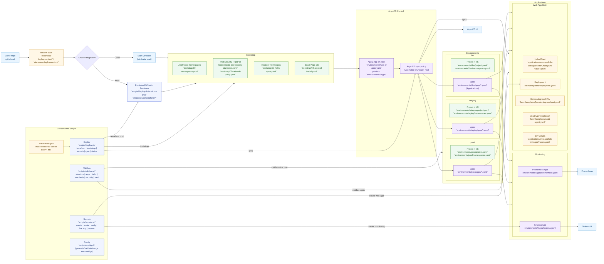

# Architecture Guide

Comprehensive overview of the repository structure, GitOps flow, environment overlays, and ArgoCD application layout.

## 🚀 Quick Start

- **New to this repository?** Start with the [Main README](../README.md) for an overview
- **Want to deploy locally?** Follow the [Local Deployment Guide](local-deployment.md)
- **Deploying to AWS?** Use the [AWS Deployment Guide](aws-deployment.md)
- **Having issues?** Check the [Troubleshooting Guide](troubleshooting.md)
- **Need to understand the structure?** Continue reading this guide

## 🏗️ Repository Structure

### Overall Architecture

The project follows a **GitOps pattern** with clear separation of concerns:

```
Production-Ready-EKS-Cluster-with-GitOps/
├── environments/           # Environment-specific configurations
│   ├── dev/               # Development environment
│   ├── staging/           # Staging environment
│   └── prod/              # Production environment
├── applications/          # Application deployments organized by domain
│   ├── monitoring/        # Monitoring stack
│   ├── infrastructure/    # Infrastructure components
│   └── web-app/          # Web application stack
├── bootstrap/            # Initial cluster setup and foundational components
├── examples/             # Sample applications and reference implementations
├── infrastructure/       # Terraform modules for AWS infrastructure
└── docs/                # Comprehensive documentation
```

## 📁 Directory Structure

### `environments/` - Environment Configurations

**Purpose**: Environment-specific settings and application discovery

```
environments/
├── dev/                    # Development environment
│   ├── app-of-apps.yaml   # Root application discovery
│   ├── project.yaml       # ArgoCD project configuration
│   ├── namespaces.yaml    # Development namespaces
│   └── apps/              # Environment-scoped applications
├── staging/                # Staging environment
│   ├── app-of-apps.yaml
│   ├── project.yaml
│   ├── namespaces.yaml
│   └── apps/
└── prod/                   # Production environment
    ├── app-of-apps.yaml
    ├── project.yaml
    ├── namespaces.yaml
    └── apps/
```

**Key Features**:
- ✅ Environment isolation
- ✅ ArgoCD application discovery
- ✅ Environment-specific configurations
- ✅ Consistent structure across environments

### `applications/` - Application Deployments

**Purpose**: Organized application deployments by domain

```
applications/
├── monitoring/                   # Monitoring stack
│   ├── grafana/
│   │   ├── staging/
│   │   │   ├── application.yaml  # Staging Grafana
│   │   │   └── values-staging.yaml
│   │   ├── values-local.yaml     # Local development values
│   │   └── values-production.yaml # Production values
│   └── prometheus/
│       ├── values-local.yaml
│       └── values-production.yaml
├── infrastructure/               # Infrastructure components
│   └── README.md
└── web-app/                     # Web application
    └── k8s-web-app/
        └── helm/                # Helm chart used by environment apps
            ├── Chart.yaml
            ├── values.yaml      # Default/production values
            └── templates/       # Kubernetes templates
```

**Key Features**:
- ✅ Domain-based organization
- ✅ Self-contained application stacks
- ✅ Environment-specific values files
- ✅ Production-ready configurations

### `bootstrap/` - Foundation Layer

**Purpose**: Initial cluster setup and core infrastructure components

```
bootstrap/
├── 00-namespaces.yaml              # Namespace definitions
├── 01-pod-security-standards.yaml  # Pod Security Standards
├── 02-network-policy.yaml          # Default network policies
├── 03-helm-repos.yaml             # Helm repository configurations
├── 04-argo-cd-install.yaml        # ArgoCD installation (Helm-based)
├── 05-vault-policies.yaml         # Vault policies and authentication
├── 06-etcd-backup.yaml            # etcd backup configuration
├── helm-values/                   # Helm values for bootstrap components
│   └── argo-cd-values.yaml       # Production ArgoCD configuration
└── README.md                     # Bootstrap documentation
```

**Key Features**:
- ✅ Numeric prefixes enforce apply order
- ✅ Self-contained foundational components
- ✅ No application-specific configurations
- ✅ Production-ready security configurations

### `infrastructure/` - AWS Infrastructure

**Purpose**: Terraform modules for AWS resources

```
infrastructure/
└── terraform/                  # Terraform configuration
    ├── modules/               # Reusable Terraform modules
    │   ├── vpc/              # VPC and networking
    │   ├── eks/              # EKS cluster
    │   ├── iam/              # IAM roles and policies
    │   └── backup/           # Backup configurations
    ├── main.tf               # Main Terraform configuration
    ├── variables.tf          # Variable definitions
    ├── outputs.tf            # Output values
    └── terraform.tfvars      # Variable values
```

## 🔄 GitOps Workflow

### 1. Bootstrap Phase

```bash
# Apply foundational components in order
kubectl apply -f bootstrap/00-namespaces.yaml
kubectl apply -f bootstrap/01-pod-security-standards.yaml
kubectl apply -f bootstrap/02-network-policy.yaml
kubectl apply -f bootstrap/03-helm-repos.yaml
kubectl apply -f bootstrap/04-argo-cd-install.yaml
kubectl apply -f bootstrap/05-vault-policies.yaml
kubectl apply -f bootstrap/06-etcd-backup.yaml
```

This sets up:
- ArgoCD installation
- Helm repositories
- Security policies
- Vault integration components

### 2. Application Deployment Phase

```bash
# Apply environment-specific root application (app-of-apps)
kubectl apply -f environments/prod/app-of-apps.yaml
```

This triggers:
- Namespace creation per `environments/<env>/namespaces.yaml`
- Application discovery for all files under `environments/<env>/apps/`
- Automated deployment and continuous reconciliation by Argo CD

### 3. Application Management Phase

Applications are managed via:
- Git commits to `environments/<env>/apps/*.yaml`
- Argo CD UI for observability and sync control
- Automated reconciliation and health monitoring

## 🎯 GitOps Principles Applied

### 1. Declarative Configuration
- All desired state defined in YAML manifests
- No imperative commands required
- Version-controlled configurations

### 2. Version Control
- All changes tracked in Git
- Immutable infrastructure
- Audit trail for all changes

### 3. Automated Reconciliation
- ArgoCD continuously monitors Git
- Automatic drift detection and correction
- Self-healing capabilities

### 4. Observable
- ArgoCD UI for application status
- Prometheus metrics for monitoring
- Grafana dashboards for observability

## 🏗️ Application Structure

### App-of-Apps Pattern

The repository uses environment-specific root applications to discover child applications defined under `environments/<env>/apps/`:

```
Root App (environments/prod/app-of-apps.yaml)
├── Monitoring Stack
│   ├── Prometheus (environments/prod/apps/prometheus.yaml)
│   └── Grafana (environments/prod/apps/grafana.yaml)
└── Web App Stack
    └── K8s Web App (environments/prod/apps/k8s-web-app.yaml)
```

### Environment Overlays

Each environment has its own configuration:

```
environments/
├── dev/                    # Development
│   ├── app-of-apps.yaml   # Discovers dev applications
│   ├── project.yaml       # ArgoCD project for dev
│   └── apps/              # Dev-specific applications
├── staging/                # Staging
│   ├── app-of-apps.yaml   # Discovers staging applications
│   ├── project.yaml       # ArgoCD project for staging
│   └── apps/              # Staging-specific applications
└── prod/                   # Production
    ├── app-of-apps.yaml   # Discovers prod applications
    ├── project.yaml       # ArgoCD project for prod
    └── apps/              # Production-specific applications
```

### Sync Waves

Applications are deployed in waves using ArgoCD sync waves:

1. **Wave 1**: Root application and namespaces
2. **Wave 2**: Infrastructure components
3. **Wave 3**: Monitoring stack
4. **Wave 4**: Security stack (Vault)
5. **Wave 5**: Applications

This ensures proper dependency ordering.

## 🔧 Application Configuration

### Values Files Structure

Applications use environment-specific values files referenced by each app under `environments/<env>/apps/*.yaml`:

```
applications/monitoring/grafana/
├── values-local.yaml        # Local development (Minikube)
├── values-staging.yaml      # Staging environment
└── values-production.yaml   # Production environment
```

### Helm Chart Structure

```
applications/web-app/k8s-web-app/helm/
├── Chart.yaml              # Chart metadata
├── values.yaml             # Default values
└── templates/              # Kubernetes templates
    ├── deployment.yaml     # Application deployment
    ├── service.yaml        # Service definition
    ├── ingress.yaml        # Ingress configuration
    ├── hpa.yaml           # Horizontal Pod Autoscaler
    ├── serviceaccount.yaml # Service account
    ├── networkpolicy.yaml  # Network policy
    ├── servicemonitor.yaml # Prometheus ServiceMonitor
    └── vault-agent.yaml    # Vault agent configuration
```

## 🚀 Adding New Applications

### 1. Create Application Directory

```bash
mkdir -p applications/new-domain/new-app
```

### 2. Create Application Manifest

Place application manifests under the environment directory, not inside the app source tree:

```yaml
# environments/prod/apps/new-app.yaml
apiVersion: argoproj.io/v1alpha1
kind: Application
metadata:
  name: new-app
  namespace: argocd
spec:
  project: production-apps
  source:
    repoURL: https://github.com/your-org/your-repo
    path: applications/new-domain/new-app
    targetRevision: HEAD
  destination:
    server: https://kubernetes.default.svc
    namespace: new-namespace
  syncPolicy:
    automated:
      prune: true
      selfHeal: true
    syncOptions:
      - CreateNamespace=true
```

### 3. Update Environment App-of-Apps

Ensure the root app includes the environment directory with directory recursion to pick up `apps/*.yaml`:

```yaml
# environments/prod/app-of-apps.yaml
apiVersion: argoproj.io/v1alpha1
kind: Application
metadata:
  name: production-cluster
  namespace: argocd
spec:
  project: production-apps
  source:
    repoURL: https://github.com/your-org/your-repo
    path: environments/prod
    targetRevision: HEAD
    directory:
      recurse: true
  destination:
    server: https://kubernetes.default.svc
    namespace: argocd
```

### 4. Commit and Deploy

```bash
git add .
git commit -m "Add new application"
git push
```

ArgoCD will automatically detect and deploy the new application.

## 🔐 Security Architecture

### Pod Security Standards

```yaml
# bootstrap/01-pod-security-standards.yaml
apiVersion: v1
kind: Namespace
metadata:
  name: production
  labels:
    pod-security.kubernetes.io/enforce: restricted
    pod-security.kubernetes.io/enforce-version: latest
    pod-security.kubernetes.io/audit: restricted
    pod-security.kubernetes.io/warn: restricted
```

### Network Policies

```yaml
# bootstrap/02-network-policy.yaml
apiVersion: networking.k8s.io/v1
kind: NetworkPolicy
metadata:
  name: default-deny-all
  namespace: production
spec:
  podSelector: {}
  policyTypes:
  - Ingress
  - Egress
```

### Vault Integration

```yaml
# Vault agent injection annotations
annotations:
  vault.hashicorp.com/agent-inject: "true"
  vault.hashicorp.com/role: "k8s-web-app"
  vault.hashicorp.com/agent-inject-secret-db: "secret/data/production/web-app/db"
  vault.hashicorp.com/agent-inject-template-db: |
    {{- with secret "secret/data/production/web-app/db" -}}
    DB_HOST={{ .Data.data.host }}
    DB_PORT={{ .Data.data.port }}
    {{- end }}
```

## 📊 Monitoring Architecture

### Prometheus Configuration

```yaml
# ServiceMonitor for application metrics
apiVersion: monitoring.coreos.com/v1
kind: ServiceMonitor
metadata:
  name: k8s-web-app
  namespace: production
spec:
  selector:
    matchLabels:
      app.kubernetes.io/name: k8s-web-app
  endpoints:
  - port: http
    path: /metrics
```

### Grafana Dashboards

- **Kubernetes Cluster Overview**: Overall cluster health and resource usage
- **Application Metrics**: Custom application dashboards
- **Infrastructure Metrics**: Node, pod, and service metrics

## 🔧 Best Practices

### Adding New Applications

1. Create domain directory under `applications/`
2. Ensure the environment `app-of-apps.yaml` discovers your application
3. Create Helm chart or Kubernetes manifests
4. Add ArgoCD `application.yaml` files
5. Update documentation

### Environment Management

- Use `environments/` for environment-specific configurations
- Maintain separate values files for different environments
- Use ArgoCD projects for environment isolation

### Secret Management

- Use Vault agent injection for automatic secret injection
- Create application-specific Vault policies
- Use dedicated service accounts for Vault authentication

### Documentation

- Keep README files updated with current configurations
- Document any changes in `CHANGELOG.md`
- Provide troubleshooting guides for complex components

## 🔍 Troubleshooting Architecture

### Common Issues

1. **Application Not Syncing**: Check ArgoCD UI for errors, verify repository access
2. **Resource Conflicts**: Review resource quotas, check for naming conflicts
3. **Bootstrap Issues**: Ensure ArgoCD is installed, check bootstrap manifests

### Debug Commands

```bash
# Check ArgoCD application status
kubectl get applications -n argocd

# View application details
kubectl describe application <app-name> -n argocd

# Check sync status
argocd app get <app-name>

# Force sync
argocd app sync <app-name>
```

## 📈 Scalability Considerations

### Horizontal Scaling

- **Applications**: Use Horizontal Pod Autoscaler (HPA)
- **Monitoring**: Scale Prometheus and Grafana based on metrics volume
- **Vault**: Use Vault HA mode for production

### Vertical Scaling

- **Resource Limits**: Set appropriate CPU and memory limits
- **Node Sizing**: Right-size EKS nodes for workload requirements
- **Storage**: Use appropriate storage classes and sizes

### Multi-Environment Scaling

- **Environment Isolation**: Separate ArgoCD projects per environment
- **Resource Quotas**: Set environment-specific resource quotas
- **Network Policies**: Implement environment-specific network policies

## 📊 Implementation Flow

### End-to-End Deployment Flow

The following diagram shows the complete implementation flow from repository clone through environment setup, bootstrap, ArgoCD application deployment, and ongoing operations:



### Flow Explanation

1. **Clone Repository**: Developer obtains the GitOps source of truth locally
2. **Choose Environment**: Select Local (Minikube) or AWS (EKS) deployment path
3. **Infrastructure Setup**: 
   - Local: Start Minikube with required addons
   - AWS: Provision EKS cluster using Terraform
4. **Bootstrap Phase**: Apply core namespaces, security policies, Helm repos, and ArgoCD installation
5. **App-of-Apps Deployment**: Deploy root ArgoCD Application that discovers child applications
6. **Environment Applications**: ArgoCD automatically syncs applications defined in `environments/<env>/apps/`
7. **Monitoring & Web Apps**: Deploy monitoring stack and sample web application
8. **Ongoing Operations**: Use consolidated scripts for deployment, validation, and maintenance

## 🔧 Validation and Quality Assurance

### Application Validation System

The repository includes comprehensive validation tools to ensure reliable deployments:

#### Validation Script (`scripts/validate-argocd-apps.sh`)

**Features**:
- ✅ Checks annotation size limits (256KB) to prevent CRD failures
- ✅ Detects large inline Helm values that cause annotation issues
- ✅ Validates required fields (spec.destination, spec.source/sources)
- ✅ Provides improvement suggestions for best practices
- ✅ Color-coded output for easy reading

**Usage**:
```bash
./scripts/validate-argocd-apps.sh
make validate-apps
```

#### Pre-commit Hook

Automatically validates applications before commits to prevent problematic code:
```bash
# Validation runs automatically on every commit
git commit -m "Add new application"
# Validation script executes and blocks commit if issues found
```

#### CI/CD Integration

GitHub Actions workflow validates applications on every push/PR:
- YAML syntax validation
- Large file detection
- Annotation size checking
- Best practices compliance

### Best Practices Enforcement

#### External Values Files Pattern
```yaml
# ✅ Good: External values file
spec:
  sources:
    - repoURL: 'https://charts.example.com'
      chart: my-chart
    - repoURL: 'https://github.com/user/repo'
      path: charts/my-app
  helm:
    valueFiles:
      - values.yaml
```

#### Minimal Inline Values Pattern
```yaml
# ✅ Good: Only essential overrides
spec:
  source:
    helm:
      values: |
        replicaCount: 3
        image:
          tag: "v1.2.3"
```

#### Lighter Chart Selection
- Use `prometheus` instead of `kube-prometheus-stack`
- Individual charts instead of umbrella charts
- Avoid charts with inherently large CRDs

### Validation Results

All applications in the repository pass validation:

```
📊 Validation Summary:
   Total files checked: 3
   Files with issues: 0
🎉 All applications passed validation!
```

**File Sizes**:
- `prometheus/application.yaml`: 994 bytes ✅
- `grafana/application.yaml`: 1,229 bytes ✅  
- `k8s-web-app/application.yaml`: 1,223 bytes ✅

---

This architecture provides a clean, maintainable, and scalable foundation for production Kubernetes deployments using GitOps principles. The structure supports multiple environments, secure secret management, comprehensive monitoring, validation systems, and easy application onboarding.
