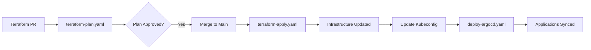
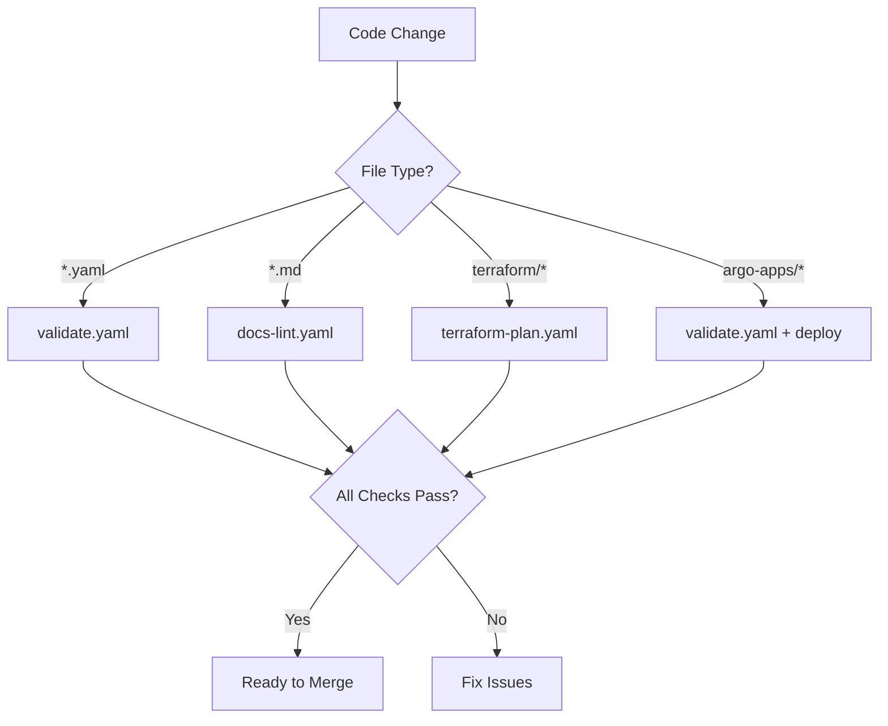

# CI/CD Pipeline Documentation

> **GitHub Actions Automation for GitOps Repository**

This document provides comprehensive documentation for the GitHub Actions workflows that automate validation, deployment, and security scanning for this GitOps repository.

---

## 📋 Table of Contents

1. [Overview](#overview)
2. [Workflows](#workflows)
3. [Setup & Configuration](#setup--configuration)
4. [Trigger Conditions](#trigger-conditions)
5. [Secrets Management](#secrets-management)
6. [Best Practices](#best-practices)
7. [Troubleshooting](#troubleshooting)

---

## 🎯 Overview

The CI/CD pipeline consists of **6 automated workflows** that ensure code quality, security, and reliable deployments:

| Workflow | Purpose | Trigger | Duration |
|----------|---------|---------|----------|
| **validate.yaml** | Comprehensive validation | PR, Push to main | 5-7 min |
| **docs-lint.yaml** | Documentation quality | PR affecting docs | 2-3 min |
| **terraform-plan.yaml** | Infrastructure planning | PR affecting terraform | 3-5 min |
| **terraform-apply.yaml** | Infrastructure deployment | Merge to main | 15-20 min |
| **deploy-argocd.yaml** | Application deployment | Merge to main, Manual | 10-15 min |
| **security-scan.yaml** | Security scanning | PR, Push, Weekly | 10-15 min |

---

## 🔄 Workflows

### 1. validate.yaml - Comprehensive Validation

**Purpose**: Validate all code before merge to prevent issues

**Jobs:**
- **yaml-validation**: Validates YAML syntax using `yq`
- **helm-lint**: Lints and templates Helm charts
- **terraform-validation**: Checks Terraform format and validates modules
- **argocd-validation**: Validates ArgoCD Application manifests and annotation sizes
- **script-validation**: Validates shell script syntax with bash and shellcheck

**Trigger Conditions:**
```yaml
on:
  push:
    branches: [main, develop]
  pull_request:
    branches: [main]
```

**Example Usage:**
```bash
# Automatically runs on:
git push origin feature-branch
# Creates PR → workflow runs automatically
```

**Validation Checks:**
- ✅ YAML syntax correctness
- ✅ Helm chart linting
- ✅ Terraform formatting (`terraform fmt -check`)
- ✅ ArgoCD annotation size limits (256KB)
- ✅ Shell script syntax
- ✅ ShellCheck analysis

---

### 2. docs-lint.yaml - Documentation Quality

**Purpose**: Maintain high-quality documentation and prevent broken links

**Jobs:**
- **markdown-lint**: Validates Markdown syntax and style
- **link-checker**: Detects broken internal and external links
- **docs-consistency**: Ensures required documentation files exist and no old paths referenced

**Trigger Conditions:**
```yaml
on:
  push:
    branches: [main, develop]
  pull_request:
    branches: [main]
    paths:
      - '**.md'
      - 'docs/**'
```

**Configuration:**
- Link checker config: `.github/markdown-link-check-config.json`
- Ignores localhost URLs
- Retries on 429 (rate limit)
- 20s timeout per link

**Checks Performed:**
- ✅ Markdown linting with markdownlint-cli
- ✅ Broken link detection
- ✅ Required documentation files present
- ✅ No references to old directory structure (argocd/, apps/, infrastructure/terraform)

---

### 3. terraform-plan.yaml - Infrastructure Planning

**Purpose**: Preview infrastructure changes and enforce policies before deployment

**Jobs:**
- **terraform-plan**: Creates and comments Terraform plan on PRs
- **policy-check**: Validates IAM policies and S3 bucket configurations

**Trigger Conditions:**
```yaml
on:
  pull_request:
    branches: [main]
    paths:
      - 'terraform/**'
      - '.github/workflows/terraform-plan.yaml'
```

**Required Secrets:**
- `AWS_ACCESS_KEY_ID` - AWS access key
- `AWS_SECRET_ACCESS_KEY` - AWS secret key

**Steps:**
1. Format check (`terraform fmt -check -recursive`)
2. Terraform init
3. Terraform validate
4. Terraform plan
5. Comment plan output on PR
6. Policy checks for IAM and S3

**Example PR Comment:**
```
#### Terraform Format and Style ✅
#### Terraform Initialization ✅
#### Terraform Validation ✅
#### Terraform Plan ✅

<details><summary>Show Plan</summary>

```terraform
Terraform will perform the following actions:
  # module.eks.aws_eks_cluster.main will be updated in-place
  ...
```

</details>

*Pushed by: @username, Action: `pull_request`*
```

---

### 4. terraform-apply.yaml - Infrastructure Deployment

**Purpose**: Automatically deploy infrastructure changes to AWS

**Jobs:**
- **terraform-apply**: Applies Terraform changes on merge to main
- Updates kubeconfig
- Tags infrastructure version
- Updates VERSION file with deployment timestamp

**Trigger Conditions:**
```yaml
on:
  push:
    branches: [main]
    paths:
      - 'terraform/**'
```

**Required Secrets:**
- `AWS_ACCESS_KEY_ID` - AWS access key
- `AWS_SECRET_ACCESS_KEY` - AWS secret key

**Steps:**
1. Terraform init
2. Terraform plan
3. Terraform apply (auto-approved)
4. Update kubeconfig for cluster
5. Extract infrastructure version from VERSION file
6. Tag release with `infra-v<version>`
7. Update VERSION file with timestamp
8. Commit VERSION changes
9. Upload Terraform outputs as artifacts

**Version Tagging:**
```bash
# Automatic tags created:
git tag -a "infra-v1.0.0" -m "Infrastructure deployment v1.0.0"
```

**Artifacts:**
- `terraform-outputs.json` (retained for 30 days)

---

### 5. deploy-argocd.yaml - Application Deployment

**Purpose**: Deploy and sync ArgoCD applications automatically

**Jobs:**
- **deploy**: Syncs all ArgoCD applications and waits for healthy status

**Trigger Conditions:**
```yaml
on:
  push:
    branches: [main]
    paths:
      - 'argo-apps/**'
      - 'helm-charts/**'
  workflow_dispatch:  # Manual trigger
    inputs:
      environment: [production, staging, development]
```

**Required Secrets:**
- `AWS_ACCESS_KEY_ID` - For EKS access
- `AWS_SECRET_ACCESS_KEY` - For EKS access
- `ARGOCD_PASSWORD` - ArgoCD admin password

**Steps:**
1. Configure AWS credentials
2. Update kubeconfig
3. Install kubectl and ArgoCD CLI
4. Wait for ArgoCD server to be ready
5. Port-forward to ArgoCD
6. Login to ArgoCD
7. Sync all applications
8. Wait for applications to be healthy
9. Generate deployment summary

**Deployment Summary Example:**
```markdown
## Deployment Summary

### Applications Deployed
- **web-app**: Healthy / Synced
- **prometheus**: Healthy / Synced
- **grafana**: Healthy / Synced
- **vault**: Healthy / Synced
```

**Manual Trigger:**
```bash
# Trigger via GitHub UI: Actions → Deploy ArgoCD Applications → Run workflow
# Select environment: production, staging, or development
```

---

### 6. security-scan.yaml - Security Scanning

**Purpose**: Identify security vulnerabilities in containers, dependencies, and configurations

**Jobs:**
- **container-scan**: Scans container images with Trivy
- **dependency-check**: Checks for vulnerable dependencies (npm, pip)
- **yaml-security**: Validates YAML security and checks for hardcoded secrets
- **kubernetes-security**: Kubernetes best practices with kubesec
- **terraform-security**: Terraform security with tfsec and Checkov

**Trigger Conditions:**
```yaml
on:
  push:
    branches: [main, develop]
  pull_request:
    branches: [main]
  schedule:
    - cron: '0 0 * * 0'  # Weekly on Sunday
```

**Security Tools:**
- **Trivy**: Container and config scanning
- **tfsec**: Terraform security scanning
- **Checkov**: Infrastructure as Code security
- **kubesec**: Kubernetes manifest security
- **yamllint**: YAML linting

**Checks Performed:**
- ✅ Container vulnerabilities
- ✅ Dependency vulnerabilities
- ✅ Hardcoded secrets detection
- ✅ Privileged containers
- ✅ hostNetwork usage
- ✅ hostPath mounts
- ✅ Terraform misconfigurations
- ✅ IAM policy issues

**SARIF Upload:**
Results are uploaded to GitHub Security tab for tracking.

---

## ⚙️ Setup & Configuration

### Required GitHub Secrets

Navigate to **Settings → Secrets and variables → Actions** and add:

| Secret Name | Description | Used By |
|-------------|-------------|---------|
| `AWS_ACCESS_KEY_ID` | AWS access key ID | terraform-plan, terraform-apply, deploy-argocd |
| `AWS_SECRET_ACCESS_KEY` | AWS secret access key | terraform-plan, terraform-apply, deploy-argocd |
| `ARGOCD_PASSWORD` | ArgoCD admin password | deploy-argocd |

### GitHub Environments

Create environment protection rules:

**Production Environment:**
```
Settings → Environments → New environment → "production"
- Required reviewers: [team members]
- Wait timer: 5 minutes
- Deployment branches: main only
```

### Branch Protection Rules

**Main Branch:**
```
Settings → Branches → Add rule
Branch name pattern: main
✓ Require a pull request before merging
✓ Require status checks to pass before merging
  - yaml-validation
  - helm-lint
  - terraform-validation
  - argocd-validation
  - script-validation
✓ Require conversation resolution before merging
✓ Do not allow bypassing the above settings
```

---

## 🔔 Trigger Conditions

### Automatic Triggers

**On Pull Request:**
- All validation workflows run
- Terraform plan runs (if terraform files changed)
- Docs lint runs (if markdown files changed)
- Security scan runs

**On Push to Main:**
- All validation workflows run
- Terraform apply runs (if terraform files changed)
- ArgoCD deploy runs (if argo-apps or helm-charts changed)
- Security scan runs

**Weekly Schedule:**
- Security scan (Sundays at midnight UTC)

### Manual Triggers

**deploy-argocd.yaml** supports manual triggering:
```bash
# Via GitHub UI
Actions → Deploy ArgoCD Applications → Run workflow → Select environment
```

**Via GitHub CLI:**
```bash
gh workflow run deploy-argocd.yaml \
  -f environment=production
```

---

## 🔐 Secrets Management

### Rotating Secrets

**AWS Credentials:**
```bash
# Generate new credentials in AWS IAM
# Update GitHub secrets
# Workflows will use new credentials on next run
```

**ArgoCD Password:**
```bash
# Get current password
kubectl -n argocd get secret argocd-initial-admin-secret \
  -o jsonpath="{.data.password}" | base64 -d

# Update GitHub secret
# Settings → Secrets → ARGOCD_PASSWORD → Update
```

### Terraform State Security

**Backend Configuration** (`terraform/environments/aws/backend.tf`):
```hcl
terraform {
  backend "s3" {
    bucket         = "your-terraform-state-bucket"
    key            = "eks-cluster/terraform.tfstate"
    region         = "us-west-2"
    encrypt        = true
    dynamodb_table = "terraform-state-lock"
  }
}
```

**Security Measures:**
- S3 bucket encryption enabled
- DynamoDB state locking
- Versioning enabled
- Access restricted via IAM

---

## 📊 Workflow Integration

### Terraform ↔ ArgoCD Integration



### Validation Flow



---

## 🛠️ Best Practices

### Writing Workflow-Friendly Code

**1. YAML Files:**
```yaml
# Good: Properly formatted
apiVersion: argoproj.io/v1alpha1
kind: Application
metadata:
  name: my-app

# Bad: Will fail validation
apiVersion: argoproj.io/v1alpha1
kind: Application
metadata
  name: my-app  # Missing colon
```

**2. Terraform Files:**
```hcl
# Good: Formatted with terraform fmt
resource "aws_eks_cluster" "main" {
  name     = var.cluster_name
  role_arn = aws_iam_role.cluster.arn
}

# Bad: Inconsistent formatting
resource "aws_eks_cluster" "main" {
    name = var.cluster_name
  role_arn=aws_iam_role.cluster.arn
}
```

**3. Shell Scripts:**
```bash
# Good: POSIX-compatible with error handling
#!/bin/bash
set -euo pipefail

# Bad: No error handling, syntax issues
#!/bin/bash
rm -rf /  # Dangerous!
```

### Testing Locally Before Push

**Validate YAML:**
```bash
make validate-all
```

**Test Helm charts:**
```bash
make validate-helm
```

**Check Terraform:**
```bash
make lint
make plan
```

**Lint documentation:**
```bash
make docs-lint
```

**Test GitHub Actions locally:**
```bash
# Install act: https://github.com/nektos/act
make test-actions-validate
```

---

## 🔧 Configuration Files

### Workflow Configuration

**`.github/markdown-link-check-config.json`**
```json
{
  "ignorePatterns": [
    {"pattern": "^http://localhost"},
    {"pattern": "^https://localhost"}
  ],
  "timeout": "20s",
  "retryOn429": true,
  "retryCount": 3
}
```

### Environment Variables

**Terraform Workflows:**
```yaml
env:
  AWS_REGION: us-east-1
  TF_VERSION: 1.5.0
```

**ArgoCD Workflows:**
```yaml
env:
  AWS_REGION: us-east-1
  ARGOCD_SERVER: localhost:8080
```

---

## 🚨 Troubleshooting

### Common Issues

#### 1. Workflow Fails on Terraform Plan

**Symptom**: "Error: Failed to load backend config"

**Solution:**
```bash
# Ensure backend.tf is configured
# Check AWS credentials are valid
# Verify S3 bucket and DynamoDB table exist
```

#### 2. ArgoCD Deploy Fails

**Symptom**: "Error: Failed to sync application"

**Solution:**
```bash
# Verify ARGOCD_PASSWORD secret is set
# Check cluster is accessible
# Verify application manifests are valid
```

#### 3. Security Scan Reports Vulnerabilities

**Symptom**: Trivy or Checkov report issues

**Action:**
```bash
# Review findings in Security tab
# Update base images
# Fix Terraform misconfigurations
# Create issues for tracking
```

#### 4. Documentation Lint Fails

**Symptom**: Broken links or markdown errors

**Solution:**
```bash
# Run locally to debug
make docs-lint

# Fix markdown syntax
# Update broken links
# Verify file paths
```

---

## 📈 Workflow Monitoring

### GitHub Actions Dashboard

View workflow runs:
```
Repository → Actions → Select workflow → View runs
```

### Workflow Status Badges

Add to README.md:
```markdown


```

### Notifications

**Configure Slack notifications:**
```yaml
- name: Notify Slack
  if: failure()
  uses: 8398a7/action-slack@v3
  with:
    status: ${{ job.status }}
    webhook_url: ${{ secrets.SLACK_WEBHOOK }}
```

---

## 🔄 Workflow Lifecycle

### Development Workflow

```
1. Create feature branch
   ↓
2. Make changes
   ↓
3. Push to GitHub
   ↓
4. validate.yaml runs automatically
   ↓
5. Create PR
   ↓
6. terraform-plan.yaml runs (if terraform changed)
7. docs-lint.yaml runs (if docs changed)
8. security-scan.yaml runs
   ↓
9. Review PR + plan comments
   ↓
10. Merge to main
    ↓
11. terraform-apply.yaml runs (if terraform changed)
12. deploy-argocd.yaml runs (if apps changed)
```

### Production Deployment Flow

```
Merge to main
↓
terraform-apply.yaml
  - Provisions/updates AWS infrastructure
  - Updates kubeconfig
  - Tags version
  - Updates VERSION file
↓
deploy-argocd.yaml
  - Logs into ArgoCD
  - Syncs all applications
  - Waits for health
  - Reports status
↓
Applications updated in cluster
↓
Monitoring alerts confirm successful deployment
```

---

## 📚 Additional Resources

### Related Documentation
- [Deployment Guide](deployment.md) - Step-by-step deployment instructions
- [Architecture Guide](architecture.md) - Repository structure
- [Scripts Documentation](scripts.md) - Script usage
- [Troubleshooting Guide](troubleshooting.md) - Common issues

### External Resources
- [GitHub Actions Documentation](https://docs.github.com/en/actions)
- [Terraform in CI/CD](https://www.terraform.io/docs/cloud/run/cli.html)
- [ArgoCD Automation](https://argo-cd.readthedocs.io/en/stable/operator-manual/ci_cd/)

---

## 🎯 Success Metrics

### Pipeline Health Indicators

✅ **< 5% failure rate** on main branch  
✅ **< 10 minutes** average validation time  
✅ **Zero** security vulnerabilities in production  
✅ **100%** deployment success rate  
✅ **< 1 hour** infrastructure deployment time  

### Monitoring Recommendations

1. Track workflow success/failure rates
2. Monitor deployment frequency
3. Track time-to-deploy metrics
4. Review security scan trends
5. Monitor infrastructure costs

---

**Last Updated**: 2025-10-11  
**Version**: 1.0.0  
**Maintained By**: Platform Engineering Team

