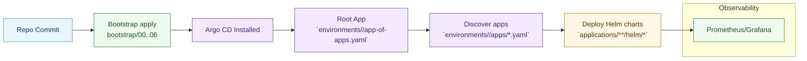

<!-- Docs Added: 2025-10-05 — High-level implementation diagram for GitOps flow. -->
# Implementation Diagram

This diagram illustrates the end-to-end flow: bootstrap -> Argo CD app-of-apps -> environment apps -> Helm chart deploys.

See `docs/architecture.md` for detailed structure and `README.md` for quick start.

